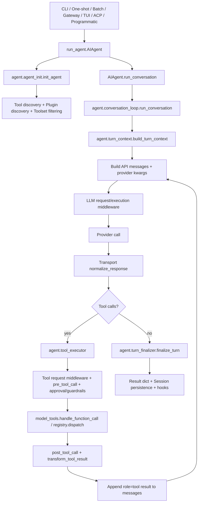
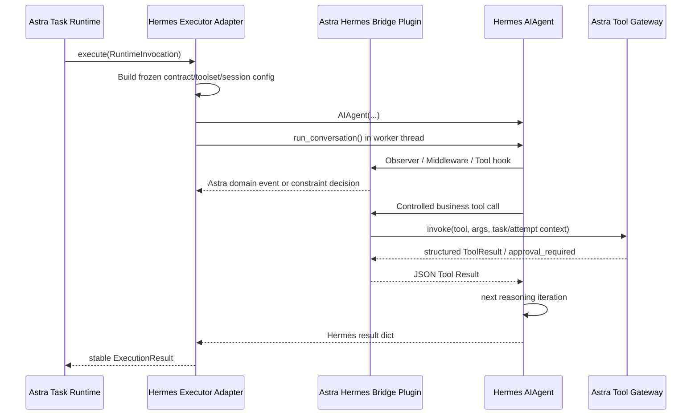

# Hermes 0.18.2 架构与 Astra 接入边界分析

> Phase 1：仓库与 Hermes 研究  
> 检查日期：2026-07-19  
> 研究范围：`docs/development_updated.md`、《深入理解 AI Agent》和 `hermes-agent-main/` 源码
> 结论适用版本：Hermes Agent `0.18.2`，Python `>=3.11,<3.14`

> Phase 3 设计更新（2026-07-19）：本文的 Hermes 源码事实和扩展点分析继续有效；旧 `Failure Detector`、`Recovery Engine`、`Outcome Validator` 命名及模块划分已由 `docs/adr/ADR-003-task-reliability-boundary.md` 和 `docs/phase3/` 中的 Task Rules、Task Policy、Requirement Evaluators、EvidenceSnapshot 与 DecisionContext 契约取代。

## 0. 结论摘要

本阶段没有修改已批准的总体架构。源码验证结果支持继续采用以下冻结分工：

- Hermes 负责 Agent Execution Logic；
- Astra Task Runtime 负责 Task Execution Lifecycle；
- Astra Reliability Harness 负责 Execution-boundary Governance；
- Astra 只通过 Observation、Constraint、Feedback 三类边界介入；
- 上层模块只依赖 Hermes Executor Adapter，不依赖 Hermes 私有对象；
- 不引入第二套 Agent Loop、Workflow、DAG 或 Planner Agent。

Hermes 0.18.2 已经提供了可复用的完整 Agent Loop、Provider 适配、Tool Calling、工具注册、上下文组装、Session、Memory、Skills、重试、Fallback、迭代预算、中断、审批、工具循环保护和可观测性能力。尤其重要的是，当前源码随附了两个有明确版本号的扩展契约：

- Observer Hooks：`hermes.observer.v1`；
- Middleware：`hermes.middleware.v1`。

这两个契约覆盖了大部分 Observation Boundary 和 Constraint Boundary。`pre_llm_call`、`transform_tool_result`、结构化工具结果以及公开的 `/steer` 语义可以支持大部分 Feedback Boundary。

当前版本存在四个必须由 Adapter 隔离或由 Astra 补齐的关键限制：

1. `AIAgent.run_conversation()` 是同步、单次用户轮次接口，不是持久化 Task Runtime；
2. Hermes 的 `completed` 表示 Agent turn 正常生成文本，不表示 Task Contract 已满足；
3. 没有通用、稳定的“任意最终文本提交前阻断并在同一 Loop 内继续”扩展点；
4. 没有稳定的累计 Token/Cost 预调用硬阻断指令。

因此 Phase 2 通过官方 Plugin、Observer、Middleware、受控工具和 `AIAgent` 程序化入口接入。模型调用前严格预算硬阻断和通用最终文本同 Loop 验证对应的 Integration Shim 均保持延后，不作为 Phase 2 初始纵向闭环的前置条件。

不能暂停并序列化当前 Python 调用栈不再作为待解决缺陷，而是 Astra 已接受的正式运行约束：Runtime 持久化 Task、InteractionRequest、ExecutionReceipt 和 Hermes Session，恢复时通过新的 Hermes turn 继续执行。

---

## 1. 版本、来源与可复现性基线

### 1.1 已确认事实

| 项目 | 证据 | 结论 |
| --- | --- | --- |
| 源码声明版本 | `hermes-agent-main/pyproject.toml` 的 `[project].version` | `0.18.2` |
| Python 范围 | `hermes-agent-main/pyproject.toml` 的 `requires-python` | `>=3.11,<3.14` |
| 来源仓库 | README 链接及项目元数据 | `NousResearch/hermes-agent` |
| 本地源码形态 | 工作区目录名 `hermes-agent-main/`，不存在 `.git/` | ZIP/快照解压源码，不是完整 Git checkout |
| 本阶段检查日期 | 当前环境日期 | 2026-07-19 |
| 本地解压时间证据 | 目录与 `pyproject.toml` 文件 birth time | 2026-07-19 11:25:08 +0800 |
| 实验 Python | 隔离环境实际输出 | Python 3.13.11，处于声明支持范围内 |

### 1.2 获取方式记录

本阶段研究对象是工作区提供的已解压源码快照，目录为 `hermes-agent-main/`。源码中的 README 指向上游仓库：

```text
https://github.com/NousResearch/hermes-agent
```

本阶段没有上游 Git 元数据，无法确认该快照对应的具体 commit SHA、tag 指向或工作树是否包含未提交修改。本文只记录源码自声明版本 `0.18.2`，不猜测、不伪造 commit。

Phase 1 关闭时已生成确定性归档和源码树 Manifest：

```text
artifacts/hermes-source-manifest.json
artifacts/hermes-source-snapshot-0.18.2.tar.gz
```

- Archive SHA-256：`200a11f1bfe275b77cf69882ed603cb1e0144153de8524b2283310d981529e3b`；
- Source tree SHA-256：`95239075bca612240d6f76ceae9b3d2d07ea7209de671641f2e89c5e09d4426e`；
- `commit_sha`：`null`；
- Python：`3.13.11`。

Manifest 同时记录了树哈希算法、归档规范化规则和本地环境/缓存排除项，可用 `scripts/generate_hermes_source_manifest.py` 重建与复核。

### 1.3 缺少 commit SHA 的影响

- 可以验证当前文件快照的行为和兼容边界；
- 不能证明该快照与上游某个 `v0.18.2` tag 或发布 artifact 字节一致；
- 无法使用 `git log`、`git blame`、commit diff 或 bisect 追踪扩展点的引入历史；
- 后续 Hermes 升级比较只能先做文件/行为差异，不能做可靠的 commit-to-commit 比较；
- 获得完整 Git 仓库后，可补充 remote URL、commit SHA、tag 和工作树状态。

缺少 commit SHA 是来源可追溯性缺口。完整 Git 仓库恢复和候选 commit 比对作为独立延后任务处理。

---

## 2. Hermes 一次任务的真实执行链

### 2.1 可用入口

| 入口 | 主要文件 | 最终调用方式 | 研究结论 |
| --- | --- | --- | --- |
| 交互式 CLI | `hermes_cli/main.py`、`cli.py`、`hermes_cli/cli_agent_setup_mixin.py` | 创建 `AIAgent`，调用 `run_conversation()` | 官方产品主入口 |
| CLI one-shot | `hermes_cli/oneshot.py` | 创建安静模式 `AIAgent`，调用 `run_conversation(prompt)` | 适合一次性命令，但内置了 one-shot 交互策略 |
| 直接 Python/脚本 | `run_agent.py` | `AIAgent(...).chat()` 或 `.run_conversation()` | 最适合 Executor Adapter 的核心入口 |
| 批处理 | `batch_runner.py` | 每个样本创建 `AIAgent`，调用 `run_conversation()` | 证明程序化批量执行可行 |
| Messaging Gateway | `gateway/run.py` | 为会话创建/缓存 `AIAgent`，在线程中运行 `run_conversation()` | 包含平台路由、排队、审批和停止等产品层逻辑，不宜作为 Astra 核心入口 |
| TUI/Desktop Backend | `tui_gateway/server.py` | JSON-RPC 后端创建 `AIAgent` 并调用 `run_conversation()` | UI 宿主，不应成为 Astra 依赖 |
| ACP | `acp_adapter/server.py`、`acp_adapter/session.py` | 创建 `AIAgent`，调用 `run_conversation()` | IDE 协议适配层，不是通用 Task Runtime |
| Cron | `cron/`、Gateway/Cron runner | 以 cron 平台配置运行 `AIAgent` | 有 watchdog 和作业状态，但语义属于 Hermes 产品 Cron，不等于 Astra Task Runtime |

### 2.2 主调用链



### 2.3 分步说明

#### 2.3.1 `AIAgent` 创建

`run_agent.py:AIAgent.__init__()` 当前是公开外观，实际将约 60 个构造参数转发给 `agent.agent_init.init_agent()`。关键参数包括：

- `base_url`、`api_key`、`provider`、`api_mode`、`model`；
- `max_iterations`、`max_tokens`、`reasoning_config`、`fallback_model`；
- `enabled_toolsets`、`disabled_toolsets`；
- `session_id`、`session_db`、`parent_session_id`；
- `ephemeral_system_prompt`、`prefill_messages`；
- `skip_context_files`、`skip_memory`；
- 工具、推理、Step、状态、流式输出等 callbacks；
- checkpoint 和 credential pool 配置。

`agent_init` 完成 Provider/API mode 判定、Client 创建、工具快照、Memory/Skills/Context Engine、Session、Token/Cost 计数器、中断状态、Guardrails、Checkpoint Manager 等初始化。

#### 2.3.2 工具发现、注册和可见性

`model_tools.py` 导入时调用 `tools.registry.discover_builtin_tools()`：

1. AST 扫描 `tools/*.py`；
2. 只导入顶层包含 `registry.register(...)` 的模块；
3. 工具模块导入时向全局 `ToolRegistry` 注册 schema、handler、toolset、`check_fn`；
4. 随后发现 MCP 工具和 Plugin 工具；
5. `get_tool_definitions()` 根据 `enabled_toolsets` / `disabled_toolsets` 解析工具集；
6. `registry.get_definitions()` 执行可用性检查并返回 Provider 所需的 function schema；
7. `AIAgent` 保存一份当前会话工具快照到 `agent.tools`，并保存名称集合到 `agent.valid_tool_names`。

工具注册表和 Plugin Manager 是进程级对象；单个 `AIAgent` 在构造时取得自己的工具 schema 快照。因此 Astra 不应按 Task 反复全局注册/注销工具，而应一次注册固定的 Astra 工具目录，再通过 toolset 和调用前策略按 Task 收窄能力。

#### 2.3.3 System Prompt 和上下文组装

真实组装路径是：

```text
run_conversation
→ build_turn_context
→ _restore_or_build_system_prompt
→ AIAgent._build_system_prompt
→ agent.system_prompt.build_system_prompt
```

System Prompt 分为三层：

- `stable`：身份、工具使用指导、模型/平台指导、Skills 索引等；
- `context`：调用者传入的 `system_message`、项目上下文文件；
- `volatile`：Memory、USER profile、外部 Memory Provider 内容、时间等。

系统提示词按 Session 缓存并保存到 SessionDB，以维持 Provider prompt cache 的字节稳定性。除上下文压缩等明确边界外，Hermes 不鼓励在会话中途重建或修改历史前缀。

`ephemeral_system_prompt` 在 API 调用时附加到有效 system prompt；`pre_llm_call` Plugin 返回的上下文则追加到当前轮 user message 的 API 副本，不修改缓存 system prompt。

这一设计与《深入理解 AI Agent》中“上下文 = 静态前缀 + 动态轨迹”以及“工具结果必须回到上下文才能形成闭环”的描述一致。

#### 2.3.4 Session 预处理

`agent.turn_context.build_turn_context()` 在第一次模型调用前完成：

- 用户输入清理；
- Task/Turn/API correlation ID 初始化；
- Session system prompt 恢复或首次构建；
- Session row 创建；
- 必要时预压缩；
- `pre_llm_call` 上下文注入；
- 外部 Memory prefetch；
- 首次 LLM 调用前的 crash-resilience 持久化。

#### 2.3.5 模型调用

每次迭代：

1. 检查 `interrupt`；
2. 消耗 `IterationBudget`；
3. 触发 `step_callback`；
4. 将内部消息转换为当前 Provider/API mode 所需格式；
5. 通过 `agent.chat_completion_helpers.build_api_kwargs()` 生成 Provider kwargs；
6. 应用 `llm_request` middleware；
7. 触发 `pre_api_request` observer；
8. 通过 `llm_execution` middleware 包裹实际 Provider 调用；
9. 按 `api_mode` 派发：
   - `chat_completions` → `client.chat.completions.create()`；
   - `codex_responses` → Responses/Codex adapter；
   - `anthropic_messages` → Anthropic adapter；
   - `bedrock_converse` → boto3 Converse adapter；
10. 成功后触发 `post_api_request`，错误路径触发 `api_request_error`；
11. Transport 将结果归一化为 Hermes 内部 assistant message。

Provider Profile 由 `plugins/model-providers/` 和 `providers` 注册系统发现。Astra 不需要也不应依赖 `ProviderProfile` 私有对象；Adapter 只传公开构造参数。

#### 2.3.6 Tool Call 解析与派发

模型返回 `tool_calls` 后，Hermes：

1. 将 assistant tool-call message 追加到上下文并增量持久化；
2. 选择顺序、并发或分段执行；
3. 解析 JSON arguments；
4. 应用 `tool_request` middleware；
5. 触发 `pre_tool_call`，处理 `block` 或 `approve` directive；
6. 应用 Hermes Tool Loop Guardrails、危险命令审批、文件 checkpoint 等；
7. 对 Agent-level 工具在 `tool_executor.py` 内直接处理；
8. 对普通工具调用 `model_tools.handle_function_call()`；
9. `handle_function_call()` 再进入 `tool_execution` middleware 与 `registry.dispatch()`；
10. handler 返回 JSON string 或受支持的 multimodal envelope；
11. 触发 `post_tool_call`；
12. `transform_tool_result` 可以替换最终工具结果；
13. 生成 `role="tool"` message 并追加到上下文；
14. 下一轮模型调用看到该结果，自主决定后续动作。

Hermes 会解析和按 schema 声明进行部分类型 coercion，但 `ToolRegistry.dispatch()` 本身不执行完整 JSON Schema 验证。因此业务参数的严格 schema、权限、审批凭证、幂等和后置结果验证仍应位于 Astra Tool Gateway。

#### 2.3.7 最终回答与停止

模型返回无 `tool_calls` 的文本后，Hermes执行必要的空响应恢复、验证 nudge、截断续写等逻辑，然后进入 `agent.turn_finalizer.finalize_turn()`：

- 处理最大迭代总结；
- 判断 Hermes turn 的 `completed`；
- 保存 trajectory；
- 清理本轮资源；
- 持久化 Session；
- 应用 `transform_llm_output`；
- 触发 `post_llm_call`；
- 组装 Token/Cost/Provider/Session 等结果字段；
- 触发 `on_session_end`；
- 返回普通 Python dict。

这个 `completed` 只表示 Hermes turn 形成了可返回结果，不表示 Astra Completion Contract 已满足。

#### 2.3.8 中断、异常和取消传播

`AIAgent.interrupt(message=None)` 是线程安全的协作中断入口：

- 设置 Agent 中断标志；
- 终止或关闭当前 Provider 请求连接；
- 将中断信号传播到并发工具 worker；
- 将中断传播到运行中的 Hermes 子 Agent；
- Tool Loop 在调用前、调用间和 Provider 等待期间检查中断；
- 结果中通常返回 `interrupted=True` 和可选 `interrupt_message`。

CLI、Gateway、TUI 和 ACP 都从其他线程/事件循环调用该入口。Astra Adapter 可采用相同模式：将同步 `run_conversation()` 放入 worker thread，Runtime 取消信号从控制线程调用 `agent.interrupt()`。

需要注意：源码中部分 Provider 限流、无效响应和错误耗尽路径直接 `return`，不会经过统一 `turn_finalizer`。因此不能只依赖 `on_session_end` 作为 Astra run-span 的必达终结事件；Adapter 必须在 `run_conversation()` 外层用 `try/finally` 产生自己的稳定执行终结事件。

---

## 3. 核心模块及职责

| 模块 | 真实职责 | Astra 依赖策略 |
| --- | --- | --- |
| `run_agent.py` | `AIAgent` 公共外观、公开中断/steer、若干兼容转发 | Adapter 可依赖 `AIAgent` 的公开构造和 `run_conversation()`；不依赖其内部属性 |
| `agent/agent_init.py` | Agent 运行时初始化、Provider/API mode、工具快照、Session/Memory/预算状态 | 私有实现，仅用于兼容研究 |
| `agent/conversation_loop.py` | 真实模型-工具循环、重试、Fallback、压缩、响应处理 | 不修改、不复制、不被上层 import |
| `agent/turn_context.py` | 单轮开始前上下文、Session、Plugin context、Memory prefetch | 私有实现；用于确认注入时机 |
| `agent/chat_completion_helpers.py` | Provider kwargs、可中断请求、API mode 派发、最大迭代总结 | 私有实现；通过 Observer/Middleware 间接使用 |
| `agent/tool_executor.py` | Tool Call 参数解析、并发/顺序执行、审批、Guardrails、结果回灌 | 私有实现；不由 Astra 直接调用 |
| `agent/turn_finalizer.py` | Turn 结果、持久化、Token/Cost、最终 hooks | 私有实现；Adapter 只消费返回 dict |
| `model_tools.py` | 工具 schema 计算、类型 coercion、普通工具派发、工具 hooks | Plugin 工具和官方 hooks 的底层实现，不向上泄漏 |
| `toolsets.py` | 内置、组合和 Plugin toolset 解析 | Adapter 使用 toolset 名称配置能力快照 |
| `tools/registry.py` | 工具元数据、schema、availability、handler dispatch、错误包装 | 通过 Plugin `ctx.register_tool()` 使用，不直接暴露 Registry 给上层 |
| `hermes_cli/plugins.py` | Plugin 发现、Hooks、Middleware、工具注册 Facade | Astra Hermes Bridge Plugin 的官方宿主 |
| `hermes_cli/middleware.py` | `hermes.middleware.v1` 请求改写和执行包装 | 主要 Constraint Boundary |
| `docs/observability/README.md` | `hermes.observer.v1` 事件契约 | 主要 Observation Boundary |
| `providers/`、`plugins/model-providers/` | Provider Profile 注册和特性适配 | 由 Hermes 拥有；Adapter 只传 provider/model 配置 |
| `hermes_state.py` | `SessionDB`、SQLite `state.db`、Session/Message/Usage 持久化 | Adapter 将 `session_id` 当 opaque handle；Runtime 不直接依赖 DB schema |
| `agent/system_prompt.py`、`agent/prompt_builder.py` | System Prompt、Skills、Context Files、Memory 组装 | 通过公开 prompt 参数和 Plugin context 使用 |
| `tools/memory_tool.py`、`agent/memory_manager.py` | 本地 Memory 文件和外部 Memory Provider | 可复用为 Agent 记忆，但不代替 Task 状态 |
| `tools/checkpoint_manager.py` | 工作目录文件快照和 rollback | 仅是文件系统安全网，不代替 Astra Task Checkpoint |
| `agent/tool_guardrails.py` | 单轮重复失败/无进展工具循环检测与可选 hard stop | 直接复用为 Agent execution reliability；Astra 只做跨 Attempt 的 Task Rule |
| `agent/trajectory.py` | 可选 ShareGPT JSONL trajectory 输出 | 可作为辅助证据，不代替 Neutral Trace |
| `gateway/`、`tui_gateway/`、`acp_adapter/` | 产品宿主、消息平台、TUI/Desktop、IDE 协议 | 不作为 Astra 核心 Executor 依赖 |

---

## 4. Hermes 已解决的 Harness 问题

| 能力 | Hermes 0.18.2 状态 | 复用判断 |
| --- | --- | --- |
| Agent Loop | 完整模型→工具→结果→下一轮推理循环 | 直接复用 |
| 模型适配与调用 | OpenAI-compatible、Responses/Codex、Anthropic、Bedrock 等统一归一化 | 直接复用 |
| Tool Calling | schema 发送、tool_call 解析、顺序/并发执行、结果回灌 | 直接复用 |
| Tool Schema 管理 | Registry、Toolset、Plugin/MCP 发现、availability check、动态 schema | 直接复用 |
| 上下文构建 | System Prompt、历史、工具定义、Memory、Skills、项目规则、压缩 | 直接复用 |
| Skills 加载 | Skills 索引、`skill_view`/`skills_list`/`skill_manage`、缓存 | 直接复用，不作为 Task Contract |
| Session 管理 | SQLite SessionDB、消息持久化、恢复、lineage、usage | 复用为 Hermes conversation state |
| Memory | `MEMORY.md`、`USER.md`、外部 Memory Provider | 可复用为 Agent memory，不保存 Task Lifecycle |
| 基础错误处理 | Tool exception JSON 化、Provider 错误分类、无效响应和空响应恢复 | 直接复用 |
| 重试与 Fallback | Provider retry、backoff、credential rotation、fallback chain | 直接复用；Task retry 仍属 Astra |
| 最大迭代限制 | `max_iterations` + `IterationBudget` + 最后一次总结 | 直接复用为 Agent step 上限 |
| Token/Cost | API usage 标准化、Session 计数、估算成本、缓存 Token | 复用观测；不能当完整账单或硬预算执行器 |
| 中断与停止 | `interrupt()`、Provider abort、工具 worker/子 Agent 传播 | 直接复用为执行取消入口 |
| 工具审批与安全 | 危险命令检测、Plugin `approve`、approval hooks、allow/deny | 复用底层机制；统一 Runtime 审批仍需 Astra |
| 重复调用/无进展基础保护 | 单轮 Tool Loop Guardrails，支持 warning 和可选 hard stop | 复用为 Hermes 内部保护；Astra 仍需任务级检测 |
| 文件 Checkpoint | 修改前透明文件快照和 `/rollback` | 复用为工作区保护，不视为任务恢复 |
| 轨迹导出 | 可选成功/失败 trajectory JSONL | 可辅助调试 |
| 可观测性 | `hermes.observer.v1`、correlation IDs、sanitized payloads | 直接作为 Astra Observer 的 Hermes 数据源 |
| 行为扩展 | `hermes.middleware.v1` 四类 middleware | 直接作为约束和执行包装入口 |

《深入理解 AI Agent》指出，Harness 的价值包括上下文管理、工具接口、安全约束、验证与纠正。Hermes 已覆盖其中“Agent 内部执行闭环”的大部分工程问题，因此 Astra 不应重写这些能力。

---

## 5. Hermes 未解决或不负责的任务级可靠性问题

### 5.1 明确属于 Astra 的能力

| 能力 | Hermes 当前能力为什么不足 | Astra 归属 |
| --- | --- | --- |
| Task Contract | Hermes 接受 prompt/toolset，但没有 Astra 的结构化任务契约实体和持久化语义 | Task Runtime + Harness |
| TaskAttempt | Hermes 有 turn/session/api attempt，不等于业务 TaskAttempt | Task Runtime |
| Task 生命周期持久化 | SessionDB 保存对话，不保存 queued/running/waiting/paused/retrying 等 Astra Task 状态机 | Task Runtime |
| 统一等待用户输入 | `clarify` 可同步回调，但没有统一、可重启恢复的 `InteractionRequest` | Task Runtime + Adapter |
| 统一审批 | Hermes 有危险命令审批，但不等于主动审批和 Tool Gateway 强制审批的统一 Runtime 路径 | Task Runtime + Tool Gateway + Adapter |
| 业务 Tool Gateway | Hermes Registry 负责调用，不负责 Astra 业务 schema、权限、审批凭证、幂等和 receipt | Astra Tool Gateway |
| 业务幂等 | Hermes 不知道外部业务副作用和业务幂等键 | Tool Gateway |
| Task 级无进展检测 | Hermes Guardrail 是单 turn、工具签名级保护，不理解 TaskAttempt、业务状态和跨重启历史 | Task Rules |
| Completion Contract 验收 | Hermes 的 `completed` 和最终文本不验证业务真值或 Completion Contract | Requirement Evaluators + Completion Aggregator |
| Task Checkpoint | Hermes checkpoint 只保存工作目录文件，不保存 Task 状态、审批、证据和外部副作用 | Task Runtime |
| 重启恢复 | Hermes 可恢复 Session，但不能恢复 Astra Task 状态机和外部交互等待 | Task Runtime |
| Neutral Trace | Hermes observer 来自被测系统内部，且部分终结路径不一致；不等于 A/B/C 共享的中立事实层 | Neutral Trace Collector |
| Evaluation Oracle | Hermes 没有独立 Rubric、业务真值和 A/B/C 评分器 | Evaluation Oracle |

### 5.2 Hermes 已有相似能力但不能混淆的项目

- Hermes Session resume ≠ Astra Task resume；
- Hermes filesystem checkpoint ≠ Task checkpoint；
- Hermes Provider retry/fallback ≠ task-level retry；
- Hermes Tool Loop Guardrail ≠ Astra cross-attempt Task Rule；
- Hermes dangerous-command approval ≠ Runtime unified approval state machine；
- Hermes `completed=True` ≠ Outcome Validation success；
- Hermes trajectory/observer ≠ Neutral Trace 和独立 Evaluation Oracle。

---

## 6. Astra 应介入的真实扩展点

### 6.1 官方文档支持的稳定扩展点

1. `AIAgent.chat()` / `AIAgent.run_conversation()` 程序化入口；
2. `AIAgent` 构造参数：Provider、模型、toolsets、session、prompt、limits、callbacks；
3. Plugin `ctx.register_tool()`；
4. Plugin Observer Hooks：`hermes.observer.v1`；
5. Plugin Middleware：`hermes.middleware.v1`；
6. `pre_tool_call` 的 `block` / `approve` directive；
7. `pre_llm_call` 当前轮 user-message context 注入；
8. `transform_tool_result` 在结果进入 Agent Context 前替换；
9. `transform_llm_output` 最终文本变换；
10. Toolset 的 enable/disable；
11. `AIAgent.interrupt()` 和公开 `/steer` 行为；
12. SessionDB/Session resume 产品能力。

### 6.2 源码确认的兼容扩展点

- `step_callback(api_call_count, prev_tools)`；
- `tool_start_callback` / `tool_complete_callback` / `tool_progress_callback`；
- `status_callback`、stream/reasoning callbacks；
- `run_conversation()` 返回 dict 的当前字段集合；
- `session_id` 作为恢复句柄；
- 通过 worker thread 调用同步 Agent，通过另一个线程调用 `interrupt()`；
- Plugin 中的受控工具 handler 将调用转发给外部 Astra Tool Gateway；
- 在 Adapter 外层对所有 return/raise 路径统一产生 Execution-ended 事件。

这些点由当前源码行为确认，但 Adapter 应归一化它们，不能让上层直接依赖回调签名或 Hermes result dict。

### 6.3 当前不存在的稳定边界

- 任意最终自然语言回答提交前，返回 `deny/pause/continue` 并让同一 Hermes Loop 继续；
- 在 Provider 调用前依据累计 Token/Cost 返回正式的硬阻断 decision；
- 序列化并恢复当前 `run_conversation()` Python 栈；
- 将任意异步反馈立即插入一个尚未产生工具结果的 Loop 位置；
- 保证所有早退错误路径都触发同一组 Session/Turn end hooks；
- TaskAttempt、InteractionRequest、EvidenceSnapshot、CompletionValidation 等 Astra 领域对象的原生支持。

---

## 7. 直接复用与 Astra 自行实现的模块划分

| 直接复用 Hermes | Astra 自行实现 | 禁止的重复实现 |
| --- | --- | --- |
| AIAgent 和 Agent Loop | Task、TaskAttempt、Task Contract | 第二套 Agent Loop |
| Provider/API mode 适配 | Task 生命周期状态机 | Workflow/DAG/Planner Agent |
| Tool schema 发送和 Tool Call 解析 | Astra Tool Gateway | 固定业务工具链 |
| Tool Registry、Plugin、Toolset | Pre/Post Tool Guard | Provider 私有适配复制 |
| Tool Result 回灌和下一轮推理 | 幂等、副作用 receipt | 自研通用 Tool Calling 框架 |
| Context、Skills、Memory、Compression | Task Rules、Task Policy | 把 Policy feedback 变成固定计划 |
| Session conversation persistence | Runtime wait/approval/input persistence | 使用 Hermes SessionDB 直接保存 Astra Task 表 |
| Provider retry/fallback | Task-level retry/recovery policy | 重写 Provider retry loop |
| `max_iterations`、基础 usage | Task/Attempt 预算和硬约束 | 用 Prompt 代替确定性约束 |
| Interrupt、基础审批、Tool Loop Guardrail | 统一 Runtime InteractionRequest | 第二套审批 UI/状态机 |
| Observer Hooks、Middleware | Neutral Trace、Evaluation Oracle | 让 Observer 参与控制 |
| Filesystem checkpoint | Task checkpoint/restart reconciliation | 假设文件 rollback 能回滚外部副作用 |

---

## 8. Observation、Constraint、Feedback 边界矩阵

### 8.1 标记说明

| 标记 | 含义 |
| --- | --- |
| `DOC` | 官方/随源码文档支持的稳定扩展点 |
| `COMPAT` | 由当前源码行为确认的兼容扩展点 |
| `NONE` | 当前版本不存在满足完整语义的稳定边界 |
| `ADAPTER` | 必须由 Hermes Executor Adapter 转换或隔离 |
| `SHIM` | 若必须满足完整语义，需要最小 Integration Shim |

一个能力可以同时有多个标记。例如 `DOC + ADAPTER` 表示 Hermes 提供稳定原语，但 Astra 领域对象和语义仍需 Adapter 转换。

### 8.2 Observation Boundary

| Astra 观测项 | Hermes 真实接入点 | 标记 | 结论 |
| --- | --- | --- | --- |
| Agent step | `step_callback(api_call_count, prev_tools)` | `DOC` `COMPAT` `ADAPTER` | 可观察每次模型迭代开始及上一批工具结果；Adapter 转为稳定 `AgentStepStarted` |
| 模型调用元数据 | `pre_api_request`、`post_api_request`、`api_request_error` | `DOC` | `hermes.observer.v1` 提供 model/provider/api mode、usage、timing、sanitized payload 和 correlation IDs |
| Tool call | `pre_tool_call` | `DOC` | 可观察有效参数和 tool/session/turn/request IDs；Observer 必须只记录，不返回 directive |
| Tool result | `post_tool_call` | `DOC` | 包含 result、duration、status、error type/message；blocked/cancelled 也有终结事件 |
| 错误 | `api_request_error`、`post_tool_call(status=error)`、Adapter 外层 exception | `DOC` `ADAPTER` | Provider/Tool 错误有稳定事件；本地 Loop 早退和未捕获异常需 Adapter 补齐 |
| Token/Cost usage | `post_api_request.usage`、`run_conversation()` usage 字段、Session usage | `DOC` `COMPAT` `ADAPTER` | Token 观测较完整；Cost 是本地估算且可能不是账单真值，需标记来源和置信度 |
| 最终回答/结果提交 | `post_llm_call`、`transform_llm_output`、返回 dict；自定义 `submit_task_result` Tool | `DOC` `ADAPTER` | 成功文本可观测；业务结果应优先通过提交工具形成明确事件 |
| 中断和状态事件 | `on_session_end`、`interrupt()` 结果、status/tool callbacks | `DOC` `COMPAT` `ADAPTER` | 正常 finalizer 路径可用；Adapter 必须为直接早退路径产生必达终结事件 |

Observation Boundary 的实现建议是一个只读 Astra Hermes Observer Plugin。它将 Hermes payload 立即复制并转换成 Astra 领域事件，不能保留 Provider SDK 对象、`AIAgent`、ToolEntry 或 SessionDB row。

### 8.3 Constraint Boundary

| Astra 约束项 | Hermes 真实接入点 | 标记 | 结论 |
| --- | --- | --- | --- |
| Agent 启动前注入 Task Contract | `ephemeral_system_prompt`、`system_message`、首轮 `pre_llm_call` | `DOC` `ADAPTER` | 可提供契约上下文；真正的 allowed tools/approval/idempotency 必须在强制边界执行，不能只靠 Prompt |
| 限定可见/可调用工具 | Plugin tools + `enabled_toolsets`/`disabled_toolsets` + `pre_tool_call` | `DOC` `ADAPTER` | 构造时形成每 Agent 工具快照；调用前再做 Task Contract 防御性校验 |
| Tool 调用前拦截 | `tool_request` middleware、`pre_tool_call` | `DOC` | `tool_request` 可规范化参数，`pre_tool_call` 可 block/approve |
| 参数 Schema 验证 | Hermes 仅做解析和部分 coercion；严格验证放在 `pre_tool_call` 或 Astra Tool Gateway | `NONE` `ADAPTER` | 没有内置完整 JSON Schema 强制执行；不需要改 Loop，由 Tool Gateway 拒绝并返回结构化错误 |
| 权限与审批校验 | `pre_tool_call` block/approve、Hermes approval gate、受控工具 handler | `DOC` `ADAPTER` | Hermes 原生审批可复用底层能力；Astra 统一 InteractionRequest 和持久等待需 Adapter/Runtime |
| 幂等与重复副作用检查 | `pre_tool_call`、`tool_execution` middleware、Astra Tool Gateway | `DOC` `ADAPTER` | 幂等真值必须由 Gateway 持久化；Hermes Tool Guardrail 只能补充单轮循环保护 |
| Step 硬限制 | `max_iterations`、`IterationBudget` | `DOC` `ADAPTER` | 可直接配置并映射为 Astra limit termination |
| Tool call 硬限制 | `pre_tool_call` 外部计数/策略 | `DOC` `ADAPTER` | Hermes 无单独通用 max-tool-calls 参数，但稳定 pre-hook 可阻断 |
| Token/Cost 硬限制 | usage observer 只能在调用后看到精确 usage；`llm_execution` 无正式 deny contract | `NONE` `ADAPTER` `SHIM` | 近似输入 Token 可预估，但若要求 Provider 调用前强制停止，需要返回 Provider-compatible synthetic response 的最小 shim 或上游新增正式 deny 语义 |
| 最终结果提交拦截 | 推荐自定义 `submit_task_result` Tool；自然语言最终回答只有 transform/post hook | `DOC` `NONE` `ADAPTER` | 工具式提交可稳定拦截并返回验证失败；任意文本的同 Loop 通用 final gate 不存在，必要时才用 shim |

### 8.4 Feedback Boundary

| Astra 反馈项 | Hermes 真实接入点 | 标记 | 结论 |
| --- | --- | --- | --- |
| 结构化工具错误 | Tool handler JSON result、blocked synthetic result、`transform_tool_result` | `DOC` `ADAPTER` | 最稳定的反馈路径；结果会作为 `role=tool` 进入下一轮 Context |
| Adapter execution observation | 在 `transform_tool_result` 中附加，或通过 `steer()` 在下一工具结果后注入 | `DOC` `ADAPTER` | 只报告执行事实，不在 Astra 复制 Hermes 错误分类与 retry policy |
| Task Policy feedback | `transform_tool_result`、`steer()`、恢复轮 `pre_llm_call`/user message | `DOC` `ADAPTER` | 必须保持事实性和建议性；不可改写成固定工具计划 |
| `UserInput` | 自定义 `request_user_input` Tool → Runtime 持久化 → 恢复时新 user turn/context | `DOC` `ADAPTER` | 不保留 Python 栈；通过同一 Hermes Session 继续上下文 |
| `ApprovalResult` | 自定义 `request_approval` Tool 或 Gateway `approval_required` → Runtime → 恢复轮反馈 | `DOC` `ADAPTER` | 与 UserInput 使用统一 InteractionRequest/恢复机制 |
| Unmet Completion Requirements | `submit_task_result` Tool 返回结构化未满足要求；或 Adapter 在 turn 结束后启动新 Execution | `DOC` `ADAPTER` | 工具式提交可在同 Loop 反馈；直接文本只能 turn 后反馈，除非使用 shim |
| Completion Requirements 缺失证据 | 提交工具结果或恢复轮 `pre_llm_call`/user context | `DOC` `ADAPTER` | 反馈指出缺失证据和有效约束，由 Hermes 自主选择下一步 |

### 8.5 Feedback 注入优先级

建议按以下优先级选择反馈路径：

1. 当前 Tool Call 的结构化 Tool Result；
2. `transform_tool_result` 对工具结果追加证据；
3. `AIAgent.steer()`，在下一次工具结果后追加中途反馈；
4. Interaction/暂停后，以同 Session 的新 user turn 注入；
5. 新 turn 开始时通过 `pre_llm_call` 注入非持久、API-bound context。

不得修改历史消息、在运行中重建 system prompt 或动态替换 toolset，以免破坏 Hermes 的 prompt cache 和消息角色不变量。

---

## 9. 缺失边界、版本限制和评估影响

| 缺口/限制 | 版本证据 | 对 Astra 的影响 | 处理方式 |
| --- | --- | --- | --- |
| 无 commit SHA | 源码快照无 `.git` | 升级差异和来源证明受限 | Manifest 已固定快照；深度追溯延后，不阻塞 Phase 1 |
| `run_conversation()` 同步 | 公开接口为 sync | Async Runtime 不能直接 await | Adapter 用专用 worker/thread；控制面调用 `interrupt()` |
| Session ≠ Task | SessionDB 保存 conversation | 不能直接作为 Task 状态机 | Runtime 自建 Task/Attempt/Interaction 存储，只保存 opaque Hermes session handle |
| 部分错误路径直接 return | 源码 retry loop 有早退 dict | `on_session_end` 不是绝对必达 | Phase 2 Adapter 用持久化原子约束实现 exactly-once 正式终结 |
| `completed` 语义过弱 | finalizer 依据文本/预算判断 | Baseline 可能“说完成”但业务未完成 | Requirement Evaluators + Completion Aggregator 独立判断；ExecutionResult 区分 agent turn 与 task outcome |
| Cost 为估算 | usage/cost 字段带 source/status | 不能直接作为财务真值 | Trace 保留 provider usage 与 estimate source；Oracle 不把估算当账单 |
| 无通用 pre-final gate | 只有 transform/post hooks | 任意文本无法同 Loop 被验证后继续 | Hermes 0.18.2 能力限制；Phase 2 使用 `submit_task_result`，Shim 延后 |
| 无累计预算 deny contract | Middleware 可包裹执行但无标准 block response | Token/Cost 难以在 Provider 前形成精确硬预算 | Hermes 0.18.2 能力限制；Phase 2 只做观测/保守限制，Shim 延后 |
| 无 Python 栈暂停恢复 | Interrupt 是协作终止 | 等待交互不能恢复原函数帧 | 已接受的运行模型；持久化后结束 turn，恢复时启动新 turn |
| Plugin/Registry 进程全局 | 源码 singleton | 动态 per-task 注册会冲突 | 固定注册一次；通过 toolsets、Task Context 和 pre-hook 收窄 |
| Prompt cache 不允许中途重建 | 仓库开发规则和源码缓存 | 反馈不能随意改 system/history | 用 Tool Result、steer、下一 user turn |
| Observer 属于被测系统内部 | Hook 由 Hermes 触发 | 不能单独承担中立评估真值 | Neutral Trace 同时记录 Runtime、Tool Gateway 和业务真值；Hermes hooks 只是一个输入源 |
| Hermes Guardrail 是单 turn | `reset_for_turn()` | 不能检测跨 Attempt/重启无进展 | Astra Task Rule 基于权威 Snapshot 判断跨 Attempt progress |
| Hermes checkpoint 只覆盖文件 | `tools/checkpoint_manager.py` | 不能回滚 CRM/订单/工单副作用 | Astra 保存 Task checkpoint + ExecutionReceipt，并恢复前对账 |

评估设计必须区分：

- Hermes 内部观测事实；
- Astra Runtime/Tool Gateway 事实；
- Mock Business Services 真值；
- Evaluation Oracle 独立结论。

Neutral Trace 不能把 `result["completed"]`、Agent 自述、CompletionValidationResult 或 PolicyDecision 直接当最终 ground truth。

---

## 10. Hermes Executor Adapter 建议端口

### 10.1 上层稳定接口

建议保持项目文档中的最小接口，不把 Hermes 类型放入签名：

```python
from dataclasses import dataclass, field
from enum import Enum
from typing import Awaitable, Callable, Mapping, Protocol, Sequence


class ExecutionStatus(str, Enum):
    SUCCEEDED = "succeeded"
    FAILED = "failed"
    INTERRUPTED = "interrupted"
    WAITING_INPUT = "waiting_input"
    WAITING_APPROVAL = "waiting_approval"
    LIMIT_EXCEEDED = "limit_exceeded"


@dataclass(frozen=True)
class RuntimeInvocation:
    execution_id: str
    task_id: str
    attempt_id: str
    user_request: str
    task_contract: Mapping[str, object]
    allowed_tools: Sequence[str]
    provider_config: Mapping[str, object]
    limits: Mapping[str, object]
    session_handle: str | None = None
    feedback: Sequence[Mapping[str, object]] = ()


@dataclass(frozen=True)
class ExecutionUsage:
    input_tokens: int = 0
    output_tokens: int = 0
    total_tokens: int = 0
    cache_read_tokens: int = 0
    cache_write_tokens: int = 0
    reasoning_tokens: int = 0
    estimated_cost_usd: float = 0.0
    cost_status: str = "unknown"
    cost_source: str = "none"


@dataclass(frozen=True)
class ExecutionResult:
    execution_id: str
    status: ExecutionStatus
    agent_turn_finished: bool
    task_outcome_validated: bool
    assistant_output: str | None
    submitted_result: Mapping[str, object] | None
    result_receipt: Mapping[str, object] | None
    session_handle: str | None
    termination_reason: str
    usage: ExecutionUsage
    error: Mapping[str, object] | None = None
    metadata: Mapping[str, object] = field(default_factory=dict)


ExecutionEventSink = Callable[[Mapping[str, object]], Awaitable[None]]


class AgentExecutor(Protocol):
    async def execute(
        self,
        invocation: RuntimeInvocation,
        event_sink: ExecutionEventSink,
    ) -> ExecutionResult:
        ...

    async def cancel(self, execution_id: str, reason: str) -> None:
        ...
```

字段可以在 Phase 2 细化，但有四个不变量：

- `session_handle` 是 opaque string，不暴露 SessionDB row；
- `metadata` 不允许放入 `AIAgent`、Provider response、ToolEntry 等对象；
- `ExecutionResult.status` 来自 Astra Execution 语义，不能直接复制 Hermes `completed`，也不能直接作为 `task.status`；
- `task_outcome_validated`、`agent_turn_finished` 与 `task.status` 必须独立；最终 Task 状态只能由 Astra Task Runtime 转换。

### 10.2 Adapter 到 Hermes 的映射

| Adapter 输入/动作 | Hermes 映射 |
| --- | --- |
| Provider 配置 | `AIAgent(base_url, api_key, provider, api_mode, model, ...)` |
| Task Contract 上下文 | 构造前生成冻结文本，传 `ephemeral_system_prompt`；必要时首轮 `pre_llm_call` |
| 可见工具 | 固定 Astra Plugin 工具 + `enabled_toolsets` |
| 调用权限 | `pre_tool_call` 查询当前 execution 的 Task Contract |
| 参数规范化 | `tool_request` middleware；严格验证仍由 Tool Gateway |
| 业务调用 | Plugin handler → Astra Tool Gateway port |
| 事件 | Observer Hooks / callbacks → Astra domain events |
| 结构化反馈 | Tool Result / `transform_tool_result` / `steer()` / 恢复轮 user context |
| 取消 | worker 外调用 `agent.interrupt(reason)` |
| 暂停 | Runtime 持久化 InteractionRequest，Adapter 中断/结束当前 turn，保存 session handle |
| 恢复 | 用同 `session_id` 和恢复后的 conversation history 启动新 `run_conversation()` |
| 最终提交 | `submit_task_result` Tool → Evidence Collection → Requirement Evaluators / Aggregator；自然语言输出作为候选结果 |
| 输出归一化 | Hermes dict → `ExecutionResult`，保留 termination reason、usage 和 opaque session handle |

### 10.3 结果提交与最终状态边界

`submit_task_result` 的模型可见签名为：

```python
submit_task_result(outcome, evidence_refs, receipt_refs)
```

Completion Contract 只能从 Astra 持久化的 Task Contract 读取，不能由模型作为参数提交。最小验证器读取实际业务状态和 ExecutionReceipt，验证引用后生成 ResultReceipt，并设置 `task_outcome_validated`。它不能直接把 Task 标记为 `succeeded`。

Task 成功必须至少满足：

```text
task_outcome_validated = true
+ no unresolved interaction
+ required business state reconciled
+ runtime termination policy satisfied
```

业务结果验证成功后，即使 Hermes 的最终自然语言说明生成失败，Runtime 也可以按终结策略保留业务成功事实，并用模板化摘要降级。此时可记录 `task_outcome_validated=true`、`agent_turn_finished=false`，而不是把已完成的业务回滚为失败。

### 10.4 推荐的 Astra Hermes Bridge Plugin

建议在 Hermes 集成层维护一个固定 Plugin，使用官方 API 注册：

- Astra 业务工具 Facade；
- `request_user_input`；
- `request_approval`；
- `submit_task_result`；
- Observer Hooks；
- `pre_tool_call` Task Contract 约束；
- 必要的 Tool/LLM Middleware；
- `transform_tool_result` 反馈标准化。

Plugin callback 通过 `execution_id` / `task_id` 查询 Adapter 内部的线程安全 execution context。Runtime、Harness、Tool Gateway、Trace 和 Evaluation 都只实现 Astra 端口，不 import Plugin、Hermes Registry 或 `AIAgent`。

### 10.5 运行模型



### 10.6 Exactly-once Execution 终结

Adapter 外层 `try/finally` 只能保证本进程尽力收敛，不能单独提供 exactly-once。Phase 2 必须同时使用内存状态机和数据库原子更新或唯一约束。推荐用 `ended_at IS NULL` 的条件更新，或对 `(execution_id, AstraExecutionEnded)` 建立唯一约束。

只有赢得持久化竞争的调用方可以生成正式终结记录、发布唯一 `AstraExecutionEnded` 并推进 Runtime。正常返回、异常、cancel、timeout、Hook/Adapter 重复结束、重启补偿和重复消费都必须经过同一约束。

### 10.7 交互暂停不变量

`request_user_input` 与 `request_approval` 的具体 Tool Result / interrupt 顺序要依据 Hermes 0.18.2 实际 Hook 时序确定，但系统必须保证：一旦 `suspension_requested=true`，Tool Gateway 或受控业务工具层立即拒绝新的副作用，InteractionRequest 被持久化，当前 Execution 协作式收敛到 `WAITING_INPUT` 或 `WAITING_APPROVAL`。

恢复时不恢复 Python 栈，而是读取已持久化状态和 Hermes Session，启动新的 Hermes turn。Interaction 解决前，Task 不能进入 `succeeded`。

---

## 11. 可选 Integration Shim 的隔离方案

### 11.1 默认不需要 Shim 的能力

以下能力可以通过官方边界完成：

- 工具注册和工具可见性；
- 模型/工具/Session 观测；
- Tool Call 前 block/approve；
- Tool 参数改写；
- Tool 执行包装；
- 结构化工具错误和反馈回灌；
- Task Contract prompt 注入；
- 中断；
- 工具式结果提交与验证失败反馈。

### 11.2 已记录但延后的两个 Shim

以下 Shim 不作为 Phase 2 初始实现的前置条件。只有实际集成证明稳定公开边界不足，并且对应能力确有需要时，才单独立项。

#### A. `PreProviderBudgetShim`

用途：在实际 Provider 调用前依据累计 Token/Cost 硬终止。

原因：`llm_request` 可以改写请求，`llm_execution` 可以短路执行，但当前没有标准 `deny/abort` 返回类型。若 middleware 直接抛异常，Hermes middleware 设计会 fail-open 并继续下游调用。

Phase 2 初期替代方案：Budget Ledger 只提供 `observe_only` 和 `conservative_limit`，记录调用次数、观测 Token、估算 Cost 和下一调用预留 Token，不宣称绝对精确的财务硬预算。

若后续确需 Shim，最小方案是在 Hermes 集成层生成当前 Transport 可接受的 synthetic terminal response，使 Loop 以明确 limit reason 结束；Adapter 再映射为 `LIMIT_EXCEEDED`。该 shim 不能向上暴露 synthetic response 类型。

#### B. `GenericFinalGateShim`

用途：拦截任意自然语言 final answer，验证失败后在同一 Agent Loop 内继续。

原因：`transform_llm_output` 只能替换最终文本，`post_llm_call` 是观察事件；二者都不能返回通用 `continue` decision。

Phase 2 初期替代方案：要求 `tool_execution` 类任务通过 `submit_task_result(outcome, evidence_refs, receipt_refs)` 提交。只有 direct text 和工具式提交都无法满足具体评估要求时，才考虑在 Adapter 后方包装私有 finalization seam。

### 11.3 不建议实现的 Shim

- 不保存/恢复 Python 栈帧；
- 不 monkeypatch 整个 `conversation_loop.run_conversation()`；
- 不 fork Hermes Agent Loop；
- 不让 Runtime 直接写 Hermes messages；
- 不让上层读取 `AIAgent._session_messages`、`_tool_guardrails` 或 Provider response；
- 不把 Gateway/TUI 的产品状态机搬进 Astra Runtime。

### 11.4 隔离目录和依赖方向

```text
app/agent/hermes_adapter/
├── executor.py                 # Astra AgentExecutor implementation
├── bridge_plugin/              # Official Hermes Plugin surface
├── result_mapper.py            # Hermes dict -> ExecutionResult
├── event_mapper.py             # Observer payload -> Astra events
├── session_handle.py           # opaque session mapping
└── shims/                      # optional, version-specific
    ├── pre_provider_budget.py
    └── generic_final_gate.py
```

```text
Runtime / Harness / Tool Gateway / Trace / Evaluation
                    ↓ Astra ports only
Hermes Executor Adapter
                    ↓
Bridge Plugin + optional shims
                    ↓
Hermes 0.18.2
```

只有 `hermes_adapter/` 可以 import Hermes。`shims/` 只能被 `executor.py` 或 Bridge Plugin 调用。

---

## 12. Phase 1 CLOSED

### 已完成内容

- 从源码确认 CLI、one-shot、批处理、Gateway、TUI、ACP 和程序化入口；
- 确认 `AIAgent → agent_init → turn_context → conversation_loop → provider → tool_executor → registry → turn_finalizer` 主链；
- 盘点 Hermes 可直接复用能力及其边界；
- 区分 Hermes Session/Checkpoint/Guardrail 与 Astra Task 级能力；
- 完成 Observation、Constraint、Feedback 三类边界矩阵；
- 区分 `DOC`、`COMPAT`、`NONE`、`ADAPTER`、`SHIM`；
- 定义不泄漏 Hermes 私有对象的 Executor Adapter 建议端口；
- 给出 Bridge Plugin 和可选 Shim 的隔离方案；
- 记录版本、来源、检查日期和缺少 commit SHA 的限制；
- 生成确定性源码归档和 `artifacts/hermes-source-manifest.json`。

### 保留结论

- Python 3.13.11 可导入并构造 Hermes 0.18.2；
- 程序化 Agent、受控工具、调用前阻断、结构化 Tool Result、下一轮推理、最终回答和 Session 持久化均已跑通；
- 没有修改 Hermes Agent Loop；
- 上层稳定接口设计不包含 Hermes 私有类型；
- 源码归档和源码树的 SHA-256 已固定并可重复生成。

### 未完成事项的正确归类

| 项目 | 性质 | 处理 |
| --- | --- | --- |
| 没有 commit SHA | 来源可追溯性缺口 | 深度追溯延后，不阻塞关闭 |
| 没有真实 Provider E2E | 验证覆盖缺口 | Phase 2 opt-in smoke test |
| 没有通用 pre-final gate | Hermes 0.18.2 能力限制 | GenericFinalGateShim 延后 |
| 没有 Provider 前精确累计预算 deny | Hermes 0.18.2 能力限制 | PreProviderBudgetShim 延后 |
| 部分早退路径绕过 finalizer | Adapter 兼容性风险 | Phase 2 持久化 exactly-once 终结 |
| 不能恢复 Python 栈 | Astra 已接受的运行模型 | 持久化状态和 Session，以新 turn 恢复 |

因此，Phase 1 正式关闭。完整阶段声明和 Phase 2 范围记录见 `docs/PHASE_STATUS.md`。

### 下一阶段最小任务

Phase 2 只先实现以下纵向闭环：

```text
RuntimeInvocation
→ Hermes Executor Adapter
→ Hermes Bridge Plugin
→ Astra Tool Gateway
→ Mock Business Service
→ submit_task_result
→ ResultReceipt
→ ExecutionResult
→ Neutral Trace
```

首批实现稳定领域接口、固定 Bridge Plugin、4～6 个业务工具、正常投诉任务、最小结果验证器、持久化 exactly-once Execution 终结、交互暂停不变量、最小 Budget Ledger 和 Neutral Trace。

不应在 Phase 2 初期实现 GenericFinalGateShim、PreProviderBudgetShim、完整 Task Runtime、Checkpoint restart recovery、Task Rules、Task Policy、完整 Requirement Evaluators / Completion Aggregator、审批 UI、前端或大规模评估。

---

## 13. 主要源码与文档证据索引

- `hermes-agent-main/pyproject.toml`
- `hermes-agent-main/run_agent.py`
- `hermes-agent-main/agent/agent_init.py`
- `hermes-agent-main/agent/conversation_loop.py`
- `hermes-agent-main/agent/turn_context.py`
- `hermes-agent-main/agent/chat_completion_helpers.py`
- `hermes-agent-main/agent/tool_executor.py`
- `hermes-agent-main/agent/turn_finalizer.py`
- `hermes-agent-main/agent/system_prompt.py`
- `hermes-agent-main/agent/tool_guardrails.py`
- `hermes-agent-main/model_tools.py`
- `hermes-agent-main/toolsets.py`
- `hermes-agent-main/tools/registry.py`
- `hermes-agent-main/tools/checkpoint_manager.py`
- `hermes-agent-main/hermes_state.py`
- `hermes-agent-main/hermes_cli/plugins.py`
- `hermes-agent-main/hermes_cli/middleware.py`
- `hermes-agent-main/docs/observability/README.md`
- `hermes-agent-main/docs/middleware/README.md`
- `hermes-agent-main/website/docs/developer-guide/agent-loop.md`
- `hermes-agent-main/website/docs/developer-guide/tools-runtime.md`
- `hermes-agent-main/website/docs/developer-guide/plugins/index.md`
- `hermes-agent-main/tests/test_model_tools.py`
- `hermes-agent-main/tests/test_transform_tool_result_hook.py`
- `hermes-agent-main/tests/hermes_cli/test_plugins.py`
- `tests/test_hermes_executor_compatibility.py`
- `scripts/generate_hermes_source_manifest.py`
- `artifacts/hermes-source-manifest.json`
- `docs/PHASE_STATUS.md`
- `docs/development_updated.md`
- `docs/深入理解-AI-Agent-李博杰-v1.txt`
