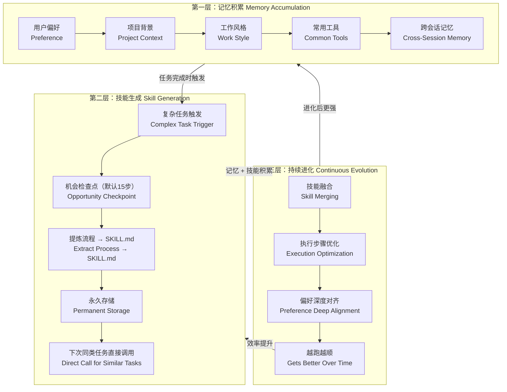

# Hermes Self-Improving Loop — Architecture Blueprint

> **Documentation Governance**
> - **Role:** Informational architecture blueprint and implementation-planning reference.
> - **Authority:** Non-normative. This document proposes no replacement for a registered Product, ADR, Runtime Design, or Acceptance authority.
> - **Scope:** The diagram-led Hermes learning loop, its three layers, the delivered content-free Evidence Association integration, and the cross-layer contracts that must be designed before implementation.
> - **Not Responsible For:** Declaring a phase complete; redefining Hermes/Astra ownership; authorizing a Skill or Memory write; defining Hermes Artifact Lifecycle behavior; or defining release eligibility or engineering acceptance.
> - **Depends On:** GOVERNANCE.DOCUMENTATION, PRODUCT.CORE, ARCH.HERMES_ASTRA_BOUNDARY, DESIGN.GOVERNANCE.EVIDENCE, DESIGN.RUNTIME.DURABLE_TASK
> - **Status:** DRAFT REFERENCE — architecture target and planning baseline; not an implementation-completion claim.

## 1. Purpose

This document records the intended **Hermes Self-Improving Loop** exactly by
the supplied three-layer architecture.  Its objective is not merely to store
more information.  It is to let Hermes become more effective on future,
similar work by accumulating useful context, extracting reusable Skills from
repeated or complex work, and continuously improving the resulting collection.

The desired outcome is:

> Later execution of the same class of Task should require less repeated
> reasoning, fewer unnecessary tool calls, and less token/context overhead,
> while remaining traceable, reversible, and inside the existing Task Contract.

This is a Hermes-native learning capability.  Hermes is the sole source of
truth for every Learning Artifact (Memory and Skill), including its content,
native identity and version, lifecycle, retrieval/matching, merging, and prompt
assembly.  Astra remains the task-level reliability and governance layer: it
stores only Evidence Associations and **Execution Admission Decisions**
concerning an artifact's use within one governed Task/Attempt/Execution
boundary.  It must not
become a second Memory system, Skill Registry, Agent Loop, Workflow Engine, or
Curator.

## 2. Reference architecture

The following Mermaid diagram is a faithful, editable transcription of the
supplied architecture diagram.  It is the canonical visual reference for this
blueprint.



The supplied diagram depicts the three learning layers.  The delivered Evidence
Association integration is a prerequisite outside that diagram and is documented
in [Section 4](#4-foundation--hermes-learning-integration-foundation); it supports the
governance boundary but does not replace, add to, or change any diagram arrow.
The arrows in the three-layer loop are meaningful and must be preserved in
Hermes-native implementation:

```text
Foundation
  └─ Astra records content-free Evidence Associations; Hermes owns maintenance

Layer 1 — Memory Accumulation
  User Preference → Project Context → Work Style → Common Tools
  → Cross-Session Memory
                         │
                         └─ on Task completion, contributes context to Layer 2

Layer 2 — Skill Generation
  Complex Task Trigger → Opportunity Checkpoint (default: every 15 steps)
  → Extract Process → SKILL.md → Permanent Storage
  → Direct Call for Similar Tasks
                         │
                         └─ accumulated Memory + Skills improve future execution

Layer 3 — Continuous Evolution
  Skill Merging → Execution Optimization → Preference Deep Alignment
  → Gets Better Over Time
                         │
                         └─ the improved result feeds stronger Memory/context
```

The vertical paths complete the Hermes-native loop: completed work can create
better context and reusable procedures; later Hermes work can use accumulated
context and procedures; their governed use can inform the separate Astra
admission boundary.

## 3. Architectural boundary and non-negotiable invariants

The blueprint follows the product boundary already recorded in the PRD and
ADR-003.

| Concern | Hermes | Astra |
|---|---|---|
| Reasoning, planning, prompt assembly, tool choice, and local replanning | Owns | Does not duplicate |
| Learning Artifact content, native identity/version, Artifact Lifecycle, retrieval/matching, merge, Curator, native storage, and prompt assembly | Sole source of truth and owner | Does not store, recreate, or control |
| Task/Attempt/Execution truth, controlled tools, approvals, evidence, completion, recovery, and audit | Consumes constraints | Owns |
| Learning Artifact evidence association and execution admission boundary | Produces native artifact/activity | Stores Evidence Associations and Execution Admission Decisions only |

The resulting constraints are:

1. A Memory or Skill may inform how Hermes performs work, but it may never
   enlarge a Task Contract, grant a new controlled tool, substitute for a
   required approval, or mark a Task complete.
2. A successful Hermes execution is not by itself evidence that a Hermes-native
   Memory or Skill is safe, correct, or fit for ordinary reuse.
3. Hermes Artifact Lifecycle and Astra Execution Admission Decision are
   separate facts.  An Execution Admission Decision is keyed to one governed
   Task/Attempt/Execution and its applicable Artifact reference; it expires
   with that governed execution and creates no Artifact-level, global, or
   long-lived admission state.
   Hermes alone transitions native states such as `pending`, `active`, `merge`,
   or `archive`; an Astra Execution Admission Decision neither edits nor
   replaces any native state.
4. The diagram's “Permanent Storage” and “Direct Call for Similar Tasks” are
   Hermes Native Capabilities.  Astra may limit admissible use within its
   governed boundary, but Hermes alone retrieves, matches, and decides whether
   to use a native Artifact.
5. Cross-layer behavior must use existing Task, Attempt, Execution, evidence,
   policy, persistence, and recovery concepts.  No parallel Task Runtime,
   evidence database, or completion path is introduced.

## 4. Foundation — Hermes Learning Integration Foundation

### 4.1 Position in the architecture

Foundation is the integration prerequisite for the three learning layers.  It
does **not** implement or schedule Memory Accumulation, Skill Generation,
Continuous Evolution, Curator maintenance, or any other Hermes-native learning
behavior.

The current implementation is limited to a locally validated content-free
Evidence Association bridge.  It is not an Admission Decision, release, or
complete-learning-governance claim.

### 4.2 Delivered capabilities

| Delivered item | What is implemented | Why it belongs in Foundation |
|---|---|---|
| Content-free Evidence Association | A read-only bridge associates a Hermes Artifact reference with Task, Attempt, Execution, profile, session, validation, safety, and provenance facts; it does not store Artifact content or lifecycle state. | Astra can retain governance-relevant evidence without owning Hermes' Artifact system. |

### 4.3 Explicit Foundation exclusions

The Foundation deliberately does **not** implement:

- Curator scheduling, configuration, invocation, or maintenance lifecycle;
- Memory collection, selection, retrieval, cross-session use, or prompt
  assembly;
- Skill content extraction, native Skill storage, matching, direct reuse,
  merging, or native Artifact Lifecycle transition;
- Hermes-native definition of “complex task”, candidate generation, Learning,
  or evaluation behavior;
- a general Learning Artifact Registry or a second Learning System.

Those exclusions keep the delivered Foundation compatible with the product
boundary and prevent an Evidence Association bridge from being mistaken for a
complete self-improving system.

## 5. Layer 1 — Memory Accumulation

### 5.1 Objective

Layer 1 reuses Hermes Native Capability for recurring, useful context and
Hermes-native Memory.  Hermes, not Astra, determines how that context is
stored, retrieved, matched, or assembled into a later prompt.  It is context
accumulation, not task authority and not an automated instruction override
system.

### 5.2 Diagram components

| Diagram component | Hermes Native Capability | Examples | Astra integration boundary |
|---|---|---|---|
| User Preference | Hermes-native preference Memory | language, desired answer depth, preferred output format | Governed use cannot override a Task Contract or approval requirement. |
| Project Context | Hermes-native project-context Memory | repository conventions, active domain, established terminology | Astra may associate governed evidence; it does not own context scope or retention. |
| Work Style | Hermes-native work-style Memory | test-first preference, review format, documentation style | Advisory input does not become Astra authorization. |
| Common Tools | Hermes-native contextual Memory | preferred project commands or read-only inspection tools | It cannot bypass Tool Gateway allowlists, schemas, or approval. |
| Cross-Session Memory | Hermes-native cross-session Memory | an approved project convention | Astra neither stores nor retrieves it; it may constrain governed use. |

### 5.3 Intended flow

1. A Hermes Task/session may observe a potentially useful fact.
2. Hermes Native Capability decides whether and how to retain it through the
   Hermes Artifact Lifecycle.
3. When the native Memory is associated with governed work, Astra can attach a
   content-free Evidence Association to Task/Attempt/Execution facts.
4. On a later Task, Hermes Native Capability alone performs retrieval,
   matching, and prompt assembly; Astra only enforces the applicable admission
   boundary for governed use.
5. The outcome of use can become evidence for a later Astra Execution Admission
   Decision for a different governed execution, without changing the native
   Memory itself.

### 5.4 Required design decisions before implementation

Layer 1 must reuse Hermes Native Capability rather than implement an Astra
“remember everything” feature.  The future cross-layer integration contract must
define only the integration boundary, including:

- how a Hermes-native Artifact reference is bound to a governed Task context,
  without reproducing the Artifact's native scope, retention, or conflict rules;
- the evidence-association fields and their relationship to the native
  artifact reference;
- the admissible-use scope Astra supplies at the execution boundary;
- how Hermes-native retrieval use is observed without treating prompt inclusion
  as proof of Task correctness;
- how an Astra Execution Admission Decision constrains one governed execution
  without transitioning a native Memory state.

### 5.5 Completion boundary

Layer 1 is not complete merely because a key-value store exists.  Its minimum
end-to-end proof is: Hermes-native Memory activity is linked to attributable
evidence when applicable; Astra records an Execution Admission Decision for
one governed execution; Hermes Native Capability performs any later
retrieval/use under a separately evaluated execution boundary; and a changed
decision affects no Artifact-level state, Task truth, or native Memory Artifact
Lifecycle.

## 6. Layer 2 — Skill Generation

### 6.1 Objective

Layer 2 reuses Hermes Native Capability to convert a repeated or sufficiently
complex successful process into a reusable Hermes-native Skill.  It targets the
visible diagram sequence:

```text
Complex Task Trigger
→ Opportunity Checkpoint (default: every 15 steps)
→ Extract Process → SKILL.md
→ Permanent Storage
→ Direct Call for Similar Tasks
```

The intended benefit is to preserve a process that has repeatedly demonstrated
value so Hermes need not rediscover the same route, tool usage, and decision
structure for every similar task.

### 6.2 Complex Task Trigger

“Complex” is a Hermes-native Learning signal, not a completion claim and not a
permission for Astra to write a Skill.  Hermes Native Capability determines
candidate-generation signals and thresholds.  Astra can only attach evidence
and enforce its Execution Admission Decision at a governed-use boundary.

### 6.3 Opportunity Checkpoint

The diagram's checkpoint is an **Opportunity Checkpoint**, with **15 execution
steps as its default parameter**.  Fifteen and the definition of an effective
execution step are Hermes-native operating behavior, not an Astra product
contract.  The only Astra boundary is that a checkpoint remains Hermes-native:
it is not an Astra Task Worker loop and cannot delay ready governed Task work.

At a checkpoint Hermes Native Capability may emit a `learning_opportunity`.
It may consider duplication, unsafe instructions, excessive context cost,
obsolete project facts, and native Skill coverage.  A
`learning_opportunity` is not a Candidate: a Hermes-native Candidate may be
created only after Task completion and Evidence Review.  The checkpoint creates
no Candidate, no Skill write, no native lifecycle transition, no Astra
Admission Decision, and no direct-use decision.

### 6.4 Extract Process → `SKILL.md`

Extraction is Hermes Native Capability that turns a reusable process into its
native `SKILL.md` form.  This blueprint does not define the content, format,
storage, or lifecycle of that file.  Any native Skill remains advisory to
Hermes planning and cannot encode a fixed Astra Workflow or claim permissions
it does not have.

A generated Skill must remain advice to Hermes' planning.  In every invocation,
Hermes still chooses actions dynamically; Astra still applies the Task Contract,
Tool Gateway, approval, idempotency, evidence, and completion rules.

### 6.5 Permanent Storage and direct call

Permanent Storage and direct call are Hermes Native Capabilities.  Hermes alone
preserves native Artifacts, evaluates native lifecycle state, retrieves/matches
them to a later Task, and decides whether to use them.  They do **not** mean
every generated file is immediately loaded into all future prompts.

For a later governed Task, Astra does not select or match a Skill.  It only
supplies the applicable admission boundary derived from the current Task
Contract and its Execution Admission Decision.  Hermes Native Capability makes
the final native retrieval and use decision within that boundary.

### 6.6 Minimum data linkage for governed candidates

The design should link a candidate reference—not necessarily its content—to:

| Link | Purpose |
|---|---|
| native artifact reference, kind, and version/reference | Identifies the Hermes Artifact to which Astra evidence is associated. |
| Task, Attempt, and Execution IDs | Establishes the governed execution context in which it arose or was used. |
| execution profile, session context, and Hermes-home fingerprint | Avoids silently mixing artifacts from incompatible environments. |
| completion validation, oracle/evaluation result, and safety findings | Provides independently inspectable support or refutation. |
| origin and creation time | Preserves whether the action came from foreground work or background review. |
| Execution Admission Decision reference | Allows one governed execution to be traced to its Astra boundary decision without changing native state. |

The first six Foundation fields already have a narrow content-free association
bridge.  Hermes Artifact Lifecycle and native storage/use policy remain Hermes
Native Capability; only their Astra integration boundary remains future work.

### 6.7 Completion boundary

Layer 2 is not complete when a `SKILL.md` file can be written.  It needs a
vertical proof that Hermes-native activity is attributable to a qualifying
Task, Astra can associate evidence and record an Execution Admission Decision,
Hermes Native Capability makes any later retrieval/use decision, and the
governed Task still passes normal controls.

## 7. Layer 3 — Continuous Evolution

### 7.1 Objective

Layer 3 reuses Hermes Native Capability to prevent Hermes Memory and Skills
from degrading as they accumulate.  Hermes performs its own Artifact Lifecycle,
including the diagrammed maintenance and evolution operations; Astra supplies
only observed evidence and the applicable admission boundary.  It is the top
diagram sequence:

```text
Skill Merging → Execution Optimization → Preference Deep Alignment
→ Gets Better Over Time
```

### 7.2 Skill Merging

Skill Merging is Hermes Native Capability.  Hermes identifies duplicate,
overlapping, or fragmented Skills and manages any successor through its own
Artifact Lifecycle.  Astra neither merges nor records the merged content or
native state; it may preserve Evidence Associations and issue an
Execution Admission Decision for one governed execution.

### 7.3 Execution Optimization

Execution Optimization is Hermes Native Capability.  Comparable Astra
execution observations can serve as evidence for an Execution Admission
Decision, but Astra does not prescribe or implement Hermes planning, retrieval,
prompt assembly, or optimization.  A faster governed run that weakens evidence
or bypasses a controlled step is not admissible within Astra's boundary.

### 7.4 Preference Deep Alignment

Preference Deep Alignment is Hermes Native Capability.  Astra does not infer,
store, retrieve, or merge preferences.  At the integration boundary, it only
ensures that governed use cannot override the current Task Contract, explicit
current input, or controlled-action requirements.

### 7.5 Gets Better Over Time: measurable rather than assumed

The final box is a hypothesis that requires comparative evidence.  The future
evaluation plan may compare compatible Hermes-native configurations and use
Astra outcome evidence, measuring outcome validity, safety findings, completion
rate, tool-call count, latency, retry/replan rate, token/context cost, and user
correction rate.  A larger artifact collection alone is not a success metric.

### 7.6 Evolution safety controls

- Astra creates no native Artifact Lifecycle transition from a model
  self-assessment alone;
- Astra Execution Admission Decisions are attributable and scoped to one
  Task/Attempt/Execution, but do not replace native state or version history or
  create Artifact-level admission state;
- Astra does not merge, retrieve, match, archive, or otherwise maintain a
  Hermes Artifact;
- a changed Astra admission boundary affects only governed use, while Hermes
  remains responsible for native non-use/archive behavior;
- Astra retains its Evidence Associations and Execution Admission Decision
  rationale for audit;
- Astra does not schedule, configure, or invoke Hermes maintenance; its
  resource behavior remains Hermes-owned.

## 8. Closed-loop lifecycle across all layers

The three layers must be integrated through one **Hermes ↔ Astra Governed
Execution Integration Contract**.  This is the currently missing contract; the
next need is not further independent Layer 1–3 design.  Without it, separate
layer implementations could make incompatible assumptions about native Artifact
states, Evidence Associations, and Execution Admission Decisions.

The integration contract must keep two lifecycles distinct: Hermes Artifact Lifecycle is
the sole native source of truth (`pending`, `active`, `merge`, `archive`, and
other Hermes-native states); Astra Execution Admission Decision is a separate,
attributable decision for one governed Task/Attempt/Execution.  Astra does not
transition, replicate, or
interpret the native lifecycle as its own state machine.

```text
1. Governed Task runs through the existing Astra ↔ Hermes execution boundary.
2. Hermes Native Capability observes useful context or a reusable process.
3. Hermes Artifact Lifecycle creates, updates, retrieves, merges, archives, or
   otherwise manages its own Memory or Skill according to native behavior.
4. Foundation preserves origin and associates the candidate reference with
   relevant Task/Attempt/Execution/evaluation facts, without owning content.
5. Astra records an Execution Admission Decision from its applicable evidence
   and Task boundary; it applies only to that Task/Attempt/Execution and does
   not change the Artifact or create future-use state.
6. Hermes Native Capability performs any later retrieval, matching, and use
   decision within the admission boundary supplied for that governed Task.
7. The next governed Task uses any Hermes-selected Artifact subject to the same
   Contract and Tool Gateway.
8. Outcome observations can inform Hermes-native Layer 3 activity and later
   Astra Execution Admission Decisions for later, separately governed
   executions; the cycle repeats.
```

Before implementation, the authoritative integration contract must make the
integration references, decision identity/idempotency, ownership, recovery
behavior, evidence association, and admission-boundary handoff explicit.  It
is the integration gate between layers, not an optional later cleanup.

## 9. Delivery sequence and status

The visual layer order is retained, but work begins with the cross-layer
contract so the completed pieces form a single loop.

| Sequence | Deliverable | Current status |
|---|---|---|
| Foundation | Content-free Evidence Association for Hermes Artifact references | **LOCALLY VALIDATED** |
| Cross-layer design gate | Hermes ↔ Astra Governed Execution Integration Contract: ownership/ADR, evidence association, per-execution admission, and compatibility with existing Phase 3/4 contracts | **NOT YET SPECIFIED** |
| Layer 1 | Hermes Native Capability for Memory, with the unified integration boundary | **BLOCKED — waiting for Hermes public interface** |
| Layer 2 | Hermes Native Capability for Skill generation/storage/use, with the unified integration boundary | **BLOCKED — waiting for Hermes public interface** |
| Layer 3 | Hermes Native Capability for merge/optimization/alignment, with the unified integration boundary | **BLOCKED — waiting for Hermes public interface and Layers 1–2 evidence** |

The existing Astra Phase 3 and Phase 4 directories are not these layers:
Phase 3 owns task governance semantics and Phase 4 owns durable Task Runtime
mechanics.  They are prerequisites and integration points for this Hermes
learning line, not alternative names for it.

## 10. Next required work

This Blueprint remains informational. The only required governed documents are:

1. [`ADR-005`](../adr/ADR-005-hermes-learning-artifact-integration.md), which
   fixes the Hermes ↔ Astra Learning Artifact integration boundary; and
2. [`Hermes ↔ Astra Governed Execution Integration Contract`](HERMES_ASTRA_GOVERNED_EXECUTION_INTEGRATION.md),
   which defines the public exchange for one governed Execution.

Layer 1–3 integration must wait until Hermes exposes public, supported
interfaces for a Task-bound Execution Boundary input, Artifact Used
Observation (native reference/version), and Artifact provenance. Until then,
Astra must not use private APIs, monkey-patches, file scanning, or any other
workaround to infer, control, or alter Hermes learning behavior.

After the public interfaces exist, implement Layer 1–3 incrementally through
those two authorities. Evaluation and Acceptance documentation are deferred
until an implemented layer supplies stable, testable behavior.
