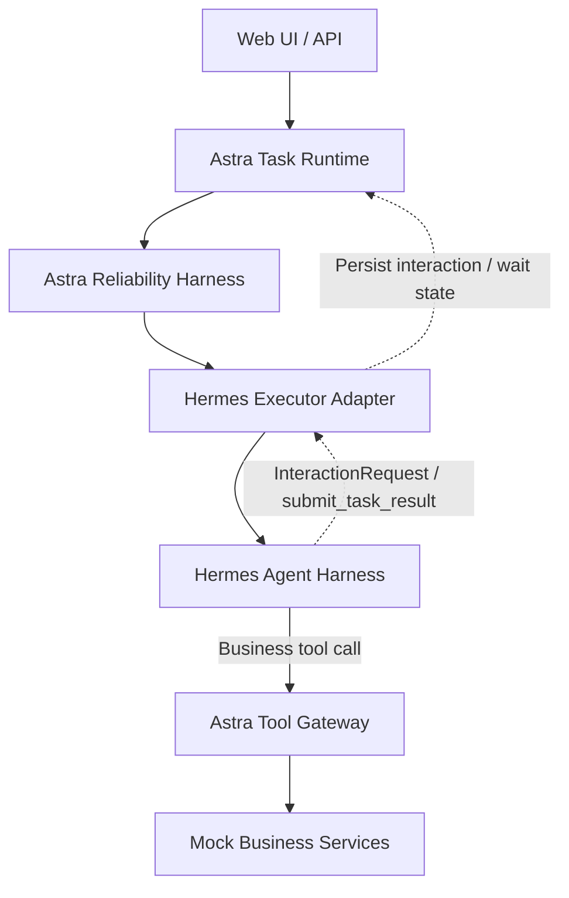
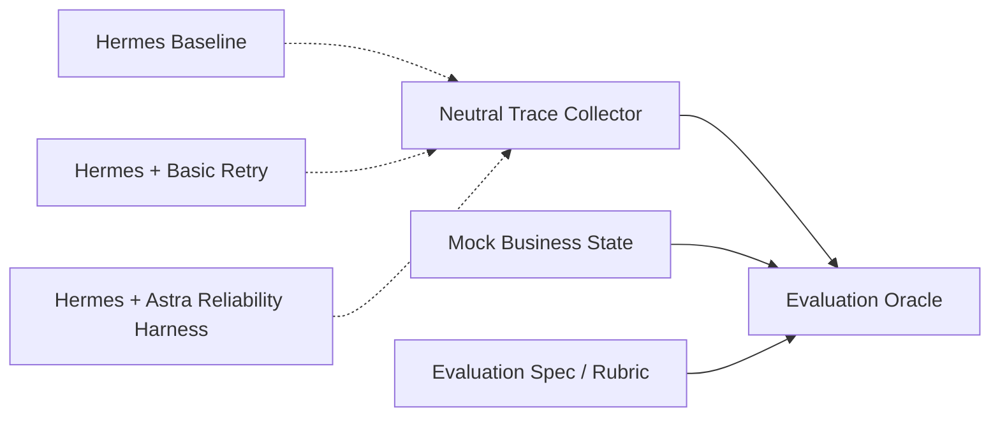

你将负责实现一个面向 Agent 可靠性研究与演示的工程项目。请先完整阅读当前仓库、现有文档，以及项目中提供的《深入理解 AI Agent》TXT 文档，再开始设计或修改代码。

## **一、项目目标**

项目暂定名：

```text
Astra Agent Reliability Harness
```

目标不是构建 Agent Platform、AI OS、Workflow Builder 或普通 Chatbot，而是：

基于成熟的 Hermes Agent Harness，构建一个能够完成真实业务任务，并具备错误检测、自动恢复、执行约束、结果验证和完整可观测性的可靠 Agent 原型。

项目必须包含一个真正自主执行任务的 Agent。

Agent 应负责：

- 理解用户任务；
- 根据当前状态决定下一步；
- 自主选择和调用工具；
- 根据工具结果调整执行策略；
- 在信息不足时请求用户补充；
- 在高风险操作前请求批准；
- 最终提交任务结果。

本项目的原创重点不是重新实现 Agent Loop，而是研究并实现：

```text
Failure Detection
Recovery
Tool Gateway Guards
Outcome Validation
Checkpoint
Trace and Replay
Evaluation
```

## **二、核心技术路线**

优先直接接入 Hermes，复用其成熟能力：

- Agent loop；
- 模型调用；
- 上下文组装；
- Tool calling；
- Skills；
- 模型适配；
- Hermes 已经可靠实现的基础重试、停止和上下文管理机制。

不要为了证明“自研”而重新手写 Hermes 已经具备的完整 Agent Harness。

首先研究 Hermes 的代码结构和扩展能力，包括但不限于：

- Agent 主循环入口；
- 模型调用链；
- Tool schema 注册方式；
- 工具执行入口；
- Tool result 回灌方式；
- Skills 加载方式；
- 上下文构建方式；
- 状态保存位置；
- 错误传播方式；
- 停止条件；
- Hooks、callbacks、middleware 或 event 接口；
- 是否支持自定义 tool executor；
- 是否支持在最终回答前拦截；
- 是否支持外部取消和状态查询。

在研究完成后，输出：

```text
docs/HERMES_ARCHITECTURE_ANALYSIS.md
```

文档只需明确：

1. Hermes 一次任务的主要调用链；
2. Hermes 各核心模块的职责；
3. Hermes 已经解决了哪些 Agent Harness 问题；
4. Hermes 尚未解决或不负责哪些任务级可靠性问题；
5. 本项目应该在哪些扩展点介入；
6. 哪些模块直接复用，哪些模块由本项目实现；
7. Observation、Constraint、Feedback 三类边界分别由哪些 documented 或 compatibility-verified stable extension points 支持；
8. 哪些所需能力缺少稳定边界、受哪些 Hermes 版本限制、对评估有何影响，以及是否需要可替换的 Integration Shim。

不要大段复制 Hermes 文档或源码。

## **三、系统边界**

### **架构原则：Black-box Integration with Execution-boundary Governance**

> **Hermes retains full ownership of Agent Execution Logic, including reasoning, tool selection, execution ordering, error adaptation, and dynamic replanning. Astra owns Task Execution Lifecycle and governs execution exclusively through stable execution boundaries by observing execution, applying deterministic constraints, and providing advisory structured feedback.**

中文规范表述：

> **Hermes 完整负责 Agent Execution Logic，包括推理、工具选择、执行顺序、错误适应和动态重新规划；Astra 负责任务执行生命周期，并且仅通过稳定的执行边界治理执行过程，包括观察执行、施加确定性约束，以及提供建议性的结构化反馈。**

本项目采用 **Black-box integration with execution-boundary governance（黑盒集成与执行边界治理）**：Astra 不依赖 Hermes 的内部实现细节，也不接管 Hermes 的 Agent Loop，而是通过已有文档说明或经兼容性验证的稳定扩展点，以及 Hermes Executor Adapter 提供的稳定接口介入执行。

“Execution”必须拆分为两个不同概念，不得再笼统表述为“Hermes 负责 Execution”或“Astra 负责 Runtime Execution”：

| 概念 | 责任主体 | 核心问题 | 主要职责 |
|---|---|---|---|
| **Agent Execution Logic** | Hermes Agent Harness | Agent 下一步应该做什么，以及如何完成任务？ | 推理、上下文解释、下一步决策、工具选择、参数生成、执行顺序、观察解释、错误适应、动态重新规划、最终回答组织 |
| **Task Execution Lifecycle** | Astra Task Runtime | 任务当前处于什么状态，是否应继续存在，以及何时启动、暂停、恢复或终止？ | Task 持久化、Task Contract、TaskAttempt、排队与启动、等待交互、暂停与恢复、task-level retry、超时、取消、Checkpoint、重启恢复和终态转换 |

准确的职责映射为：

```text
Hermes Agent Harness        → Agent Execution Logic
Astra Task Runtime          → Task Execution Lifecycle
Astra Reliability Harness  → Execution-boundary Governance
```

Astra 不把业务任务转换为固定 Workflow、DAG 或预定义工具链，不决定正常业务路径、工具调用顺序或动态计划。Execution-boundary Governance 不会把 Agent Execution Logic 的所有权从 Hermes 转移给 Astra。

### **三类执行边界**

所有 Astra 与 Hermes 之间的执行介入必须归入以下三类稳定边界：

```text
Observation Boundary → Observe
Constraint Boundary  → Constrain
Feedback Boundary    → Correct
```

不得使用含义更宽泛的 `Control Boundary`；统一使用 `Constraint Boundary`。

#### **Observation Boundary**

Observation Boundary 只暴露执行事件和元数据，用于 Neutral Trace、Adapter normalization 和 Evaluation 证据采集，不改变执行行为。典型内容包括 Agent step、模型调用元数据、Tool call、Tool result、Token/Cost usage、错误事件、Task 状态事件、Trace span、`InteractionRequest`、最终结果提交事件，以及初始和最终业务状态快照。

Observation Boundary 只能读取和记录，不得修改 Prompt、工具参数或工具结果，不得阻止工具调用、注入 Policy feedback、触发 Task 决策、改变 Task 状态或调用 Requirement Evaluator。

#### **Constraint Boundary**

Constraint Boundary 负责施加确定性的执行约束，并产生 `allow`、`deny`、`pause` 或 `abort` 等强制决定。典型内容包括：

- Task Contract 能力边界与 `allowed_tools`；
- 参数 Schema 和类型检查；
- Task/Attempt 的 execution、deadline、token 和 cost 上限，以及经 Adapter 配置的 Hermes `max_iterations`；
- Tool Gateway Pre-call Guard 的权限、风险、审批凭证、幂等与重复副作用检查；
- 最终结果提交拦截。

Constraint Boundary 只回答“当前动作是否满足确定性约束，是否允许继续”。它不判断业务下一步、不选择业务工具、不制定完整恢复方案，也不替 Hermes 动态重新规划。确定性约束是强制性的，必须由 Astra 在此边界执行，而不能只作为 Prompt 建议期待 Hermes 自觉遵守。

#### **Feedback Boundary**

Feedback Boundary 将新的结构化事实、证据、约束信息和非命令式建议送回 Hermes 执行上下文。典型内容包括 `ApprovalResult`、`UserInput`、结构化工具错误、Checkpoint 恢复信息、新获得的权威业务事实、Policy feedback，以及尚未满足的 Completion Requirements。

> **Feedback is advisory rather than imperative.**
>
> **反馈是建议性的，而不是命令性的。**

Astra 可以说明发生了什么、证据是什么、哪些动作已无效、哪些确定性约束仍然有效、缺少哪些信息，以及建议考虑何种恢复方向，但不得通过反馈规定完整的业务执行计划。Hermes 独立解释反馈、选择下一步并动态重新规划。

结构化反馈中的字段语义必须明确区分：

```json
{
  "constraints": [
    "Do not call issue_refund without valid approval"
  ],
  "suggestions": [
    "Consider requesting approval",
    "Consider checking the exception policy"
  ]
}
```

`constraints` 描述 Astra 已在 Constraint Boundary 强制执行的确定性边界；`suggestions` 仅供 Hermes 判断。Hermes 可以不采纳建议，但不能绕过有效约束。

正确的纠错流程是：

```text
Astra detects an issue
→ Astra produces structured evidence and advisory feedback
→ Feedback is injected into Hermes context
→ Hermes observes the new information
→ Hermes independently selects the next action
→ Hermes dynamically replans
```

不得实现为 Astra 生成完整业务 Workflow，再由 Hermes 机械执行。

### **稳定集成与隔离原则**

Astra Reliability Harness 应优先通过以下稳定入口集成 Hermes：

- documented extension points；
- compatibility-verified stable extension points；
- hooks、callbacks、middleware、events；
- custom tool executors；
- Hermes Executor Adapter 暴露的稳定接口。

如果 Hermes 当前版本缺少所需稳定扩展点，只能在 Hermes 集成层引入最小、可替换的 Integration Shim。Shim 只能由 Hermes Executor Adapter 感知；Astra Task Runtime、Task Rules、Task Policy、Requirement Evaluators、Completion Aggregator、Tool Gateway、Neutral Trace Collector 和 Evaluation Oracle 都不得依赖 Shim 或 Hermes 私有对象。

Hermes 升级或替换时，变化应被限制在 Hermes Executor Adapter 和可选 Integration Shim 内。若某项可靠性能力无法通过稳定边界实现，必须显式记录缺少的边界、受影响能力、Hermes 版本限制、对评估的影响和可能的补足方案，不得通过跨越架构边界的方式隐式实现。

整体架构采用**外部 Astra Task Runtime 托管 Hermes**。Astra Task Runtime 是一个薄任务级 Runtime，不是通用 Agent Platform Runtime。Hermes 是 Runtime 调用的 Agent Executor / Agent Harness，而不是整个系统的 Runtime。Astra Reliability Harness 位于外部可靠性治理层，逻辑上包裹并通过稳定执行边界介入 Hermes 执行。

总架构如下：



必须保持以下语义：

- **Astra Task Runtime 是 Hermes 外部的任务级 Runtime**，负责 Task 生命周期、持久化、暂停、恢复、取消、等待交互和服务重启恢复。
- **Hermes Agent Harness 是 Runtime 内被调度的 Agent 执行内核**，不是 Astra Task Runtime 本身。
- **Hermes Executor Adapter 是稳定端口**，Runtime 和 Reliability Harness 不直接依赖 Hermes 私有实现；所有 Hermes 版本适配和可选 Integration Shim 都隔离在该端口之后。
- **Astra Reliability Harness 逻辑上位于 Hermes 外部，但必须介入关键执行节点**：Agent 启动前、工具调用前后、工具失败、循环或无进展、最终结果提交。
- **Astra Tool Gateway 是 Hermes 访问受控业务工具的统一入口**。Hermes 决定调用什么工具；Tool Gateway 内部通过 Pre-call Tool Guard、Tool Adapter 和 Post-call Result Guard 完成 Schema、权限、审批要求判定、审批凭证校验、幂等、错误标准化、结果验证和执行凭证。审批请求、等待状态和审批结果持久化仍由 Astra Task Runtime 负责。Tool Guard 不是与 Tool Gateway 平级的独立运行层。
- **Runtime interaction primitives 不属于普通业务工具**。`request_user_input` 与 `request_approval` 可以在 Hermes 看来呈现为协作工具，但由 Hermes Executor Adapter 转交 Astra Task Runtime；它们不经过 Mock Business Services，而是创建并持久化 `InteractionRequest`，使 Task 进入 `waiting_input` 或 `waiting_approval`。
- **主动审批和强制审批必须合并为同一条 Runtime 审批路径**。Hermes 主动调用 `request_approval`，或 Tool Gateway 因高风险业务调用返回 `approval_required`，最终都由 Adapter 转换为同一种 `InteractionRequest(kind="approval")`，由 Runtime 持久化、等待和恢复。不得实现两套审批状态机或两套审批 UI/API。
- **Neutral Trace Collector 与 Evaluation Oracle 位于被测系统控制逻辑之外**。Neutral Trace 对 A/B/C 三组使用相同 Observer 契约，只记录、不干预；Evaluation Oracle 使用统一 Rubric、Neutral Trace 和 Mock 业务真值独立评分，不依赖 Agent 自述、C 组 CompletionValidationResult 或 PolicyDecision。
- Runtime 与 Reliability Harness 职责分离：Runtime 管理 Task Execution Lifecycle；Reliability Harness 观察执行、检测是否跑偏、施加强制约束、验证结果并提供建议性纠错反馈；具体如何调整业务执行仍由 Hermes 决定。

### **Task Contract / Completion Contract 驱动执行**

任务完成采用契约判定，而不是仅依赖 Agent 的语义自判：

> Task completion is contract-based, not based solely on the Agent’s semantic self-judgment. Execution paths are dynamically decided by the Agent within declared capabilities and constraints.

Agent 开始执行前，系统必须根据 Task Contract 明确并持久化以下最小信息：

```text
task_type
execution_type
allowed_capabilities / allowed_tools
completion_requirements
approval_requirements
```

其中，Completion Contract 表示 Task Contract 中用于最终验收的 `completion_requirements` 及其可验证证据要求。第一版不需要为两种 Contract 引入独立的复杂实体、DSL 或编排层，可以直接作为 `Task` 的结构化字段保存。

第一版 `execution_type` 保持简单：

- `direct_response`：允许 Agent 直接回答，不强制调用 Tool；完成依据响应类完成要求判定。
- `tool_execution`：完成必须有可验证的实际业务状态或 `ExecutionReceipt`，不能仅根据 Agent 的自然语言声明判定成功。
- `interaction_required`：缺少完成任务所需的必要信息时，Hermes 通过 Runtime `InteractionRequest` 使 Task 进入 `waiting_input`。
- `approval_required`：执行受控高风险操作前，必须通过统一审批机制使 Task 进入 `waiting_approval`。

Task Contract 只定义能力边界、完成条件、审批要求和可靠性约束，不定义固定执行步骤、工具调用顺序或完整 Workflow。系统不得把业务任务硬编码为固定工具链，也不得要求模型在任务开始时先生成完整 Workflow 后机械执行。

Hermes Agent 继续通过受控 Agent Loop 动态决定执行路径：

```text
Observe
→ Decide Next Action
→ Execute
→ Observe Result
→ Correct
→ Continue
```

职责边界如下：

- 系统负责：Task Contract、Capability / Tool Boundary、Completion Requirements、Approval Requirements、Reliability Constraints。
- Hermes Agent 负责：Next Action、Tool Selection、Execution Order、Dynamic Replanning、Error Adaptation。

Task Contract 不引入 Workflow Engine、DAG、固定业务流程、Planner Agent 或新的复杂 Runtime，也不改变现有的 `Astra Task Runtime → Astra Reliability Harness → Hermes Executor Adapter → Hermes Agent Harness → Astra Tool Gateway → Business Services` 架构链路。

### **结果提交与状态权威性**

模型可见的结果提交接口必须是：

```python
submit_task_result(
    outcome,
    evidence_refs,
    receipt_refs,
)
```

`completion_requirements` 不能由模型提交。模型只能声明结果并引用证据/回执；系统从 Astra 持久化的 Task Contract 读取 Completion Contract，再读取实际业务状态和 ExecutionReceipt，验证后生成 ResultReceipt。

以下概念必须分离：

```text
task_outcome_validated
agent_turn_finished
task.status
```

结果验证成功不直接等于 Task 成功。最终状态只能由 Astra Task Runtime 在以下条件满足后转换：

```text
task_outcome_validated = true
+ no unresolved interaction
+ required business state reconciled
+ runtime termination policy satisfied
→ Task may enter succeeded
```

业务结果已经验证通过后，Hermes 最终自然语言说明的网络错误不能把业务事实回滚为失败。Runtime 可以记录 `agent_turn_finished=false`、用户说明缺失，并按策略使用模板化摘要降级。

### **统一审批路径**

主动审批路径：

```text
Hermes 调用 request_approval
→ Hermes Executor Adapter
→ Astra Task Runtime 创建或复用 InteractionRequest(kind="approval")
→ Task: running → waiting_approval
```

Tool Gateway 强制审批路径：

```text
Hermes 调用高风险业务工具
→ Astra Tool Gateway Pre-call Guard 返回 approval_required
→ Hermes Executor Adapter
→ Astra Task Runtime 创建或复用同一种 InteractionRequest(kind="approval")
→ Task: running → waiting_approval
```

审批凭证至少绑定：

```text
task_id
attempt_id
tool_name
normalized_arguments_hash
risk_level
idempotency_key
expires_at
```

Runtime 持久化审批结果后，由 Adapter 将结果注入原 Hermes 执行上下文，Tool Gateway 再校验审批凭证。主动审批若已精确覆盖后续调用，则不得重复请求；工具名称或关键参数发生变化时，原审批失效并重新进入统一审批路径。

推荐定义稳定 Executor 接口：

```python
class AgentExecutor:
    async def execute(
        self,
        invocation: RuntimeInvocation,
    ) -> ExecutionResult:
        ...
```

Hermes 通过 `HermesExecutor` / `Hermes Executor Adapter` 实现该接口。后续更换 Agent Harness 时，不应要求重写 Astra Task Runtime。

Hermes Executor Adapter 主要负责：

- 将 `RuntimeInvocation` 转换为 Hermes 执行上下文；
- 注入 Task Contract、允许的 capabilities / tools 和有效确定性约束；
- 注入 `UserInput`、`ApprovalResult` 与建议性的 Policy feedback；
- 将业务工具调用转发到 Astra Tool Gateway；
- 将 Runtime interaction primitives 转交 Astra Task Runtime；
- 将最终结果提交转交 Astra result submission port，后续由 Evidence Collection 和 Requirement Evaluators 验收；
- 将 Hermes 输出转换为稳定的 `ExecutionResult`；
- 隔离 Hermes 版本变化、内部对象和可选 Integration Shim。

Hermes Executor Adapter 不得承担 Task Execution Lifecycle，不得自行实现 Agent Loop、替 Hermes 选择下一步工具、把 Policy feedback 转换为固定业务 Workflow，也不得让 Astra 上层模块依赖 Hermes 私有对象。

### **Hermes Agent Harness / Agent Execution Logic**

Hermes 作为 Astra Task Runtime 内被调度的 Agent Executor 使用，不得等同于整个系统的 Task Runtime。

负责：

- Agent 推理循环；
- 上下文与 Prompt 组装；
- Context interpretation；
- Skills；
- 工具选择；
- 工具参数生成；
- 在 Task Contract 边界内动态决定下一步和执行顺序；
- Observation interpretation；
- 根据观察结果进行动态重规划和错误适应；
- 模型适配；
- 最终回答组织；
- 完整的 Agent Execution Logic。

### **Astra Reliability Harness**

位于 Hermes 外部可靠性治理层，但必须优先通过 Hermes 的 hooks、callbacks、middleware、events、自定义 tool executor 或 Adapter 等稳定扩展点介入执行过程；缺少扩展点时仅在 Hermes 集成层采用最小、可替换的 Integration Shim，不要 fork 并重写整个 Hermes。

负责：

- 观察 Agent 执行；
- 拦截关键执行节点；
- 检测失败和异常；
- 在 Constraint Boundary 应用确定性约束；
- 消费 Astra Tool Gateway 的结构化检查与执行结果；
- 根据工具失败、危险操作或重复副作用证据生成结构化事实与建议性恢复反馈；
- 验证最终结果是否真实完成；
- 记录完整执行轨迹。

Astra Reliability Harness 不再实现一个与 Astra Tool Gateway 平级的 Tool Guard。所有业务工具的强制执行约束由 Tool Gateway 内部管道落实；Harness 负责解释结构化失败、选择有限的恢复机制并向 Hermes 提供证据、约束信息和建议。Hermes 保留后续业务动作选择与动态重新规划的所有权。

### **Astra Task Runtime / Task Execution Lifecycle**

这是位于 Hermes 外部的薄任务级 Runtime。它托管 Task，并通过 Hermes Executor Adapter 启动或恢复 Hermes Agent；不负责模型推理、Agent Loop 或工具选择。

仅负责：

- Task 持久化；
- 在 Agent 启动前解析并持久化 Task Contract / Completion Contract；
- TaskAttempt；
- task-level retry；
- 基础任务状态；
- RuntimeEvent；
- Checkpoint；
- 取消；
- 超时；
- 等待用户输入；
- 等待人工批准；
- 服务重启后的任务恢复。

不要扩展成：

- 完整 Workflow Engine；
- 多 Executor 平台；
- Marketplace；
- 通用 AI Employee Platform；
- 多租户治理平台；
- 复杂 RBAC；
- 多 Agent 编排；
- 完整 Human Executor；
- 通用 Memory Engine。

系统边界最终统一概括为：

> **Hermes 负责 Agent Execution Logic；Astra Task Runtime 负责 Task Execution Lifecycle；Astra Reliability Harness 负责 Execution-boundary Governance。Astra 通过 Observation、Constraint 和 Feedback 三类稳定边界进行观察、约束和纠错，其中约束具有强制性，反馈仅具有建议性，最终业务决策和动态重新规划始终由 Hermes 完成。**

## **四、具体 Agent 场景**

实现一个：

```text
Customer Complaint Resolution Agent
```

该 Agent 不是客服问答机器人，而是一个能够执行客服运营任务的 Agent。

示例任务：

客户收到损坏商品，要求退款，但订单已经超过普通退款期限，请调查并处理投诉。

根据当前事实，Agent 可能需要执行或覆盖以下业务动作与结果：

1. 查询客户信息；
2. 查询订单状态；
3. 检索售后和退款政策；
4. 判断是否存在例外条款；
5. 识别缺失信息；
6. 必要时向用户询问；
7. 判断是否需要主管批准；
8. 创建投诉工单；
9. 执行退款、换货或拒绝操作；
10. 验证业务系统中的最终状态；
11. 生成带证据的处理结果。

以上列表用于描述场景能力和业务覆盖范围，不是固定步骤或调用顺序。Hermes 可以跳过不适用的动作、补充必要检查、调整工具顺序，并根据工具结果动态重规划；系统只要求其不越过 Task Contract 的能力和审批边界，并最终满足 Completion Contract。

该场景的最小 Task Contract 示例：

```yaml
task_type: complaint_resolution
execution_type: tool_execution
allowed_capabilities:
  - get_order
  - search_policy
  - create_complaint_ticket
  - issue_refund
completion_requirements:
  - complaint resolution outcome exists
  - required business state is persisted
  - required side effects are verified
  - no unresolved required interaction or approval remains
approval_requirements:
  - controlled high-risk operations require valid runtime approval
```

该 Contract 不表示必须依次执行 `get_order → search_policy → create_complaint_ticket → issue_refund`，也不要求始终调用其中全部能力。具体下一步、工具选择和执行顺序由 Hermes 在执行时动态决定。

第一版只使用 Mock Business Services，不接真实企业系统。

建议 Hermes 可见的任务能力控制在 8～10 个左右，并区分业务工具、Runtime interaction primitives 与结果提交能力：

```text
# Business tools（经 Astra Tool Gateway 调用 Mock Business Services）
get_customer
get_order
search_policy
create_complaint_ticket
issue_refund
create_replacement
notify_customer

# Runtime interaction primitives（由 Adapter 转交 Astra Task Runtime）
request_user_input
request_approval

# Result submission primitive（Phase 2 触发最小结果验证器，后续接 Requirement Evaluators 与 Completion Aggregator）
submit_task_result
```

所有能力必须有清晰的输入输出 Schema。`request_user_input` 与 `request_approval` 不得实现成返回模拟文本的普通函数：它们必须创建 `InteractionRequest`、持久化等待原因，并由 Runtime 改变 Task 状态。Astra 不恢复进程内 Python 调用栈；恢复时 Adapter 读取 Task、InteractionRequest、ExecutionReceipt 和 Hermes Session，通过新的 Hermes turn 注入用户输入或审批结果并继续执行。

具体 Hook 和 interrupt 顺序由 Hermes 0.18.2 的实际时序决定，不提前绑定固定顺序。但必须维持运行时不变量：一旦 `suspension_requested=true`，Tool Gateway 或受控业务工具层必须拒绝新的副作用，InteractionRequest 必须持久化，当前 Execution 必须协作式收敛到 `WAITING_INPUT` 或 `WAITING_APPROVAL`。Interaction 解决前 Task 不得进入 `succeeded`。

## **五、可靠性契约**

Phase 3 先冻结契约，不先创建运行模块。各契约必须按执行边界分工协作，而不是形成第二套 Agent Loop：

| 执行边界 | 主要模块或入口 | 语义 |
|---|---|---|
| Observation Boundary | Neutral Trace、Adapter observations | 观察和记录，不参与 Task 决策 |
| Constraint Boundary | Task/Attempt limits、Tool Gateway Guard、审批、幂等、完成 gate | 强制执行确定性治理约束 |
| Feedback Boundary | Policy feedback、工具结构化错误、Interaction resolution、未满足 Requirement | 向 Hermes 提供事实、约束和非命令式建议 |

同一个事件可以先被 Observation Boundary 记录，再触发 Constraint Boundary 的强制决定或 Feedback Boundary 的结构化反馈，但三类语义必须在接口和 Trace 中可区分。

### **1. Deterministic Limits**

Hermes 负责单次 Agent Loop 内的 `max_iterations`、Tool Loop Guardrail 和局部停止。Astra 可以通过 Adapter 配置 Hermes 已有的执行上限，但不再实现一套重复调用检测或同调用 hard-stop controller。

Astra 自己强制的限制必须是 Task governance 边界：

```text
task_deadline
max_attempts
max_executions_per_attempt
attempt_deadline
max_feedback_cycles
max_reconcile_cycles
task-level token / cost / provider request budget
```

Tool Gateway 继续强制权限、审批、Schema、幂等和副作用限制。达到 Task/Attempt limit 后，Runtime 产生权威状态变化和 Decision Point，由 Task Policy 在 `fail`、`escalate` 或允许的 lifecycle action 中选择；它不输出要求 Hermes 重试或修复参数的 `GuardViolation`。

单次 Tool timeout、参数错误、Provider retry 和重复调用适应由 Hermes 处理。只有当它们最终影响 Execution terminal result、Task budget 或跨 Attempt progress 时，Astra 才消费相应权威记录或 normalized Fact。

#### **Phase 2 最小 Budget Ledger**

Phase 2 初期不实现完整财务硬预算。Adapter 只记录：

```text
provider_request_count
observed_input_tokens
observed_output_tokens
observed_total_tokens
estimated_cost_usd
reserved_next_call_tokens
```

运行模式只有 `observe_only` 和 `conservative_limit`。前者只观测，后者按保守估算在明显可能超限时限制后续调用。Cost 保持估算语义，不宣称与 Provider 账单精确一致；历史价格库、汇率、账单对账、完整 Provider Proxy 和 `PreProviderBudgetShim` 均延后。

### **2. Phase 3 Task Reliability and Governance 边界**

旧的 Failure Detector、Recovery Engine、执行期错误枚举和 Tool retry 动作设计已经废弃，不再作为 Phase 3 实施依据。正式职责边界为：

> **Hermes owns Agent execution reliability. Astra owns Task truth and governance.**

Hermes 负责单次 Agent 执行内部的推理、工具选择、错误适应、参数修复、Provider retry/fallback、局部重试、动态 replanning 和单 turn 循环保护。Astra 不实现 `retry_same_call`、`retry_with_backoff`、`repair_arguments`、`replan` 或固定业务工具计划。

Astra 负责持久化 Task truth、Task/Attempt/Execution 生命周期权威、外部副作用责任、Completion Contract、Receipt、Interaction、跨 attempt 治理、Task-level limits 和可审计 PolicyDecision。

新的 Phase 3 结构为：

```text
Authoritative Records
→ atomic Fact/Outbox or Evidence Collection
→ Authoritative Evidence Snapshot + supporting Reliability Facts
→ Task Rules / Requirement Evaluators
→ DecisionContext
→ Task Policy
→ PolicyDecision
→ Runtime CAS + atomic transition
```

Reliability Fact 不是第二套权威数据库。Task、Attempt、Execution、Receipt、Interaction、ExternalOperation 和外部 Business Entity 仍是 Authoritative Record。Policy、Rule 和 completion gate 必须读取带 version 的权威 Snapshot；Fact 只提供不可变治理证据和来源索引。

本次重新设计的权威文档为：

```text
docs/adr/ADR-003-task-reliability-boundary.md
docs/phase3/TASK_LIFECYCLE.md
docs/phase3/RELIABILITY_FACTS_AND_EVIDENCE.md
docs/phase3/TASK_RULES.md
docs/phase3/TASK_POLICY.md
docs/phase3/REQUIREMENT_EVALUATORS.md
docs/phase3/DECISION_POINTS_AND_SNAPSHOTS.md
```

### **3. Task Rules and Task Policy**

Task Rules 只判断跨对象、跨 Execution/Attempt 和跨重启的治理不变量，例如：

```text
cross_attempt_no_progress
duplicate_side_effect
late_state_affecting_record
recovery_divergence
receipt_business_state_mismatch
```

Task Rules 不检测 JSON 参数错误、Tool timeout、Provider 是否可重试或 Hermes 是否应再次调用 Tool。Rule 只返回 `pass`、`finding`、`indeterminate`、`not_applicable` 或 `rule_error`，Finding 不包含 recommended action。

Task Policy 只允许以下 Task 级动作：

```text
complete
continue_with_feedback
start_new_attempt
request_input
request_approval
reconcile
fail
escalate
```

PolicyDecision 不直接修改 Task；Task Runtime 使用 DecisionContext、稳定 decision key、expected Task/Attempt version 和数据库 CAS 原子应用。`continue_with_feedback` 只能提供权威事实、证据引用、未满足 Requirement、当前强制约束和非命令式建议，不得包含 Tool 参数、调用顺序、Workflow 或业务计划。

所有 Task/Attempt continuation 必须受 `max_attempts`、Task deadline、`max_executions_per_attempt`、Attempt deadline、feedback 和 reconciliation 次数上限约束。

### **4. Astra Tool Gateway 内部 Tool Guard 管道**

Tool Guard 不是独立运行层，而是 Astra Tool Gateway 内部负责调用前检查与调用后验证的核心组件：

```text
Astra Tool Gateway
├── Pre-call Tool Guard
├── Tool Adapter
└── Post-call Result Guard
```

所有业务工具调用在执行前后经过该管道。Runtime interaction primitives 不经过 Mock Business Services，也不走普通业务 Tool Adapter。

调用前检查：

- Tool 是否存在；
- 参数 Schema；
- 参数类型；
- 当前任务是否允许调用；
- 风险等级；
- 是否需要批准；
- 是否已经执行过相同副作用；
- 幂等键。

Tool Gateway 只判定是否需要批准并校验 Runtime 签发或持久化的审批凭证，不拥有 `waiting_approval` 状态，也不自行创建另一套人工审批流程。缺少有效审批凭证时，Pre-call Guard 返回结构化 `approval_required`，由 Adapter 转换为与 Hermes 主动 `request_approval` 完全相同的 Runtime `InteractionRequest(kind="approval")`。审批恢复后再次执行调用时，Tool Gateway 只做凭证与当前工具参数的精确匹配校验。

调用后检查：

- 返回格式；
- 错误标准化；
- 业务状态是否与返回值一致；
- 是否产生可记录的 execution receipt。

涉及退款、创建换货、通知客户等副作用的工具必须支持幂等。

### **5. Requirement Evaluators and Completion Aggregator**

禁止仅根据 Agent 的自然语言声明或 Hermes `completed` 把 Task 标记为成功。正式结构为：

```text
CompletionContract
→ CompletionRequirement[]
→ Evidence Collection
→ immutable EvidenceSnapshot
→ Evaluator Registry
→ RequirementEvaluation[]
→ Completion Aggregator
→ CompletionValidationResult
```

Evidence Collector 负责读取 Receipt、Interaction、ExternalOperation 和外部 Business State，并持久化 Observation、生成固定 EvidenceSnapshot。Evaluator 不允许边读取实时业务系统边写 Fact，而只能对固定 Snapshot 进行纯函数式评估。

每个 Requirement 固定 `evaluator_id` 和 `evaluator_version`。RequirementEvaluation 状态为：

```text
satisfied
unsatisfied
unknown
evaluator_error
```

第一版 Aggregator 只支持 `all_required`：任何 required evaluator error 产生 `evaluator_error`；否则任何 required unsatisfied 产生 `unsatisfied`；否则任何 required unknown 产生 `indeterminate`；全部 required satisfied 才产生 `satisfied`。

Evaluator 不修改 Task、不触发 Tool、不创建 Interaction、不选择 Policy、不重新解释 Completion Contract。Aggregator 不理解 Complaint、Ticket、Customer 或 Order 等业务字段。Phase 2 最小 Complaint validator 后续作为第一个业务 Evaluator 迁移，而不是继续扩展为 Core Validator。

CompletionValidationResult 直接进入 Task Policy。Task Rule 不再重复生成 `completion_claim_conflict` 或 `false_completion` Finding。Pending Interaction、未完成 reconciliation、未确认的 required ExternalOperation 和版本匹配属于 Runtime completion invariants，也不需要包装成 Finding。

Task 进入 `succeeded` 必须同时满足：

```text
CompletionValidationResult.status = satisfied
+ no pending blocking Interaction
+ no unresolved reconciliation
+ no required ExternalOperation in uncertain state
+ Task/Attempt versions match DecisionContext
+ Runtime atomic completion transition succeeds
```

### **6. Trace and Replay**

Trace 分为共享的中立观测数据和 C 组额外的可靠性事件。Neutral Trace Collector 位于 Reliability Harness 之外，A/B/C 三组都必须使用同一 Observer 契约、字段、采集逻辑和脱敏规则。

Neutral Trace Collector 只能观察，不得：

- 阻止工具调用；
- 修改参数、Prompt 或工具结果；
- 触发 Task Policy 或创建新 Attempt；
- 注入 Policy feedback；
- 改变 Task 状态；
- 调用 Requirement Evaluator 或 Completion Aggregator。

三组共同记录：

- Task 状态变化；
- 每次 Agent step；
- 模型调用元信息；
- 工具调用及参数；
- 工具结果；
- InteractionRequest；
- 最终结果提交；
- 必要的初始与最终业务状态快照；
- 错误；

C 组可以额外记录：

- Reliability Fact refs；
- EvidenceSnapshot refs；
- RuleEvaluation / Finding；
- CompletionValidationResult；
- PolicyDecision 及其 applied/stale 状态；

Neutral Trace 至少包含：

```text
trace_id
span_id
parent_span_id
task_id
attempt_id
event_type
timestamp
source
input_summary
output_summary
status
error
duration
token_usage
```

Trace 使用父子 span 结构，数据模型尽量兼容 OpenTelemetry/OpenInference，但 MVP 可以先存入 PostgreSQL 或 SQLite。Neutral Trace 是 Evaluation Oracle 的证据输入之一，但 Trace 中的 Agent 自述、Harness 自评、CompletionValidationResult 或 PolicyDecision 都不能单独作为评估真值。

必须支持查看一次任务的时间顺序轨迹。

Replay 第一版不要求重新调用真实模型，只需能够：

- 读取历史 Trace；
- 按顺序展示关键步骤；
- 标记第一个失败点；
- 显示 Task Policy 决策；
- 显示最终 Task truth、Completion 和状态转换结果。

## **六、任务状态**

Phase 3 必须明确区分 Task、Attempt 和 Execution 状态。完整规范见 `docs/phase3/TASK_LIFECYCLE.md`。

Task 状态保持克制：

```text
pending
running
waiting_input
waiting_approval
reconciling
succeeded
failed
cancelled
```

Task row 必须有单调递增 `version`。终态为 `succeeded`、`failed`、`cancelled`，终态后禁止普通状态转换。

Attempt 状态：

```text
active
waiting
reconciling
completed
failed
exhausted
superseded
cancelled
```

`continue_with_feedback` 和 Interaction resume 在同一 Attempt 创建新 Execution；`start_new_attempt` 必须在一个事务内结束旧 Attempt 并创建新 Attempt。Provider retry、Tool retry、参数修复和 Hermes replanning 不创建 Astra Attempt。

每个 Attempt 必须受 `max_executions_per_attempt`、Attempt deadline、feedback 和 reconciliation 次数限制；Task 受 `max_attempts` 和 Task deadline 限制。

Execution 状态使用 `running`、`completed`、`failed`、`interrupted`、`waiting_input`、`waiting_approval`、`limit_exceeded`、`cancelled`。除 `running` 外均为终结状态。`waiting_input` / `waiting_approval` 表示当前 Execution 已结束而 Task 进入等待，不表示 Python 调用栈仍被暂停。

### **Execution 终结与 Task 状态分离**

Execution 的 exactly-once 正式终结必须由内存状态机和数据库原子更新或唯一约束共同保证。只依赖内存锁、单进程 compare-and-set 或本地状态标记，无法覆盖重启、多实例竞争、重复补偿和重复消费。

可使用 `(execution_id, event_type=AstraExecutionEnded)` 唯一约束，或执行 `WHERE ended_at IS NULL` 的一次性条件更新。只有真正赢得持久化更新的调用方才能生成正式终结记录、发布唯一 `AstraExecutionEnded` 并推进 Runtime；其他竞争调用只能识别“已经结束”。

该约束必须覆盖正常返回、cancel、timeout、异常、Hook/Adapter 重复终结、进程重启后的补偿，以及 Hermes 绕过正常 finalizer 的路径。

Execution 已结束不等于 Task 已成功。Task 仍可能处于 `waiting_input`、`waiting_approval`、等待业务状态对账或等待 Runtime 终结判定。Task 最终状态只能由 Astra Task Runtime 决定。

建议最小数据结构：

```text
Task
TaskAttempt
Execution
RuntimeEvent
Checkpoint
InteractionRequest
ToolInvocation
ExecutionReceipt
ResultReceipt
ExternalOperation
ReliabilityFact
EvidenceSnapshot
RequirementEvaluation
CompletionValidationResult
RuleEvaluation
PolicyDecision
TaskResult
TraceSpan
```

`Task` 第一版最小扩展以下结构化字段，不新增 Workflow、DAG 或 Planner 数据模型：

```text
task_type
execution_type
allowed_capabilities
allowed_tools
completion_requirements
approval_requirements
```

`allowed_tools` 可以是系统根据 `allowed_capabilities` 和当前环境解析出的受控工具子集。Agent 启动前，Runtime 将这些字段作为执行边界经 Hermes Executor Adapter 注入执行上下文；Tool Gateway 使用相同边界做调用前校验；Requirement Evaluator Registry 使用其中的 `completion_requirements` 作为 Completion Contract 的核心输入。Task 状态仍保持有限集合，不因引入 Contract、Rule 或 Evaluator 增加业务 Workflow 状态。

不要提前增加大量暂时用不到的实体。

评估域与 Runtime 数据模型分离。`EvaluationRun`、`EvaluationResult` 和 Rubric 版本信息属于 `evaluation/`，不得成为 Task 状态或由 C 组 Reliability Harness 写入评分结论；Evaluation Oracle 只读取中立证据后独立生成这些结果。

## **七、故障注入环境**

Mock Business Services 必须支持可配置故障注入，例如：

```text
CRM 返回 503
工具超时
返回无效 JSON
缺少字段
退款第一次失败
权限不足
重复请求
业务状态写入成功但响应丢失
工具声称成功但实际未写入
政策文档冲突
```

故障注入必须可通过测试配置确定性复现，不要只使用随机故障。

例如：

```yaml
scenario:
  get_order:
    first_call: timeout
    second_call: success
```

## **八、评估要求**

### **独立 Evaluation Oracle**

必须实现独立于 A/B/C 被测系统的 Evaluation Oracle。它不是 Astra Reliability Harness 的运行模块，不参与 Agent 决策、不改变 Task 状态、不触发 Task Policy，也不把 C 组 CompletionValidationResult 或 PolicyDecision 直接当作实验真值。

评估架构如下：



该图只描述评估旁路，不属于产品主执行链：

- A/B/C 使用同一 Neutral Trace Collector；
- 虚线表示只观察、不影响被测系统；
- Evaluation Oracle 同时读取 Neutral Trace、Mock Business State 与 Evaluation Spec / Rubric；
- Oracle 只生成 `EvaluationResult`，不得修改 Task、TaskAttempt 或任何生产运行状态；
- C 组额外的可靠性事件可以进入 Trace 用于诊断，但不能直接决定 Oracle 评分。

Evaluation Oracle 使用以下中立证据评分：

```text
Evaluation Task Specification
Rubric
初始 Mock 业务状态
最终 Mock 业务状态
共享 Neutral Trace
Execution Receipts
用户模拟器结果
```

Oracle 必须独立查询 Mock Business Services 或评估环境的最终状态。以下内容不能单独作为通过依据：

- Agent 的自然语言完成声明；
- C 组 CompletionValidationResult；
- Task Policy 报告的恢复或完成；
- Reliability Harness 自己记录的 Task 成功。

Oracle 输出统一的 `EvaluationResult`，例如：

```json
{
  "task_id": "eval-017",
  "passed": false,
  "score": 0,
  "failure_reasons": [
    "refund_record_missing",
    "ticket_linked_to_wrong_order"
  ],
  "safety_violations": [],
  "duplicate_side_effects": 0
}
```

建立最小评估集，对比：

```text
A. Hermes Baseline
   Hermes + 统一 Tool Schema / Tool Adapters / Mock Business Services
   启用共享 Neutral Trace 和独立 Evaluation Oracle
   Tool Gateway 仅保留协议解析和 Adapter 路由，不启用 Astra 可靠性 Guard 管道
   不启用 Astra Task Rules、Task Policy、Requirement Evaluators、Evidence reconciliation 和 Task-level limits

B. Hermes + Basic Retry
   在 A 的基础上，仅对明确的 transient error 做固定次数重试
   继续使用与 A/C 完全相同的 Neutral Trace 和 Evaluation Oracle
   不启用其他 Astra 检测、恢复、验证或 Guard 能力

C. Hermes + Astra Reliability Harness
   启用完整 Tool Gateway Guards、Task/Attempt limits、Evidence Snapshot、Requirement Evaluators、Task Rules、Task Policy 和 restart reconciliation
   继续使用与 A/B 完全相同的 Neutral Trace 和 Evaluation Oracle
```

三组必须共享同一 Tool Adapter 和 Mock 环境。除被评估的可靠性能力外，使用相同：

- Hermes 固定版本及基础配置；
- 模型；
- Prompt；
- Tool Schema 与 Tool Adapter；
- 初始业务数据；
- 任务集；
- Neutral Trace Schema、采集位置与脱敏规则；
- Evaluation Oracle、Rubric 与评分逻辑。

必须在 `docs/EVALUATION_METHOD.md` 中列出 Hermes 原生能力与各组开关状态，避免 Hermes 内置重试、Guardrail 或 Checkpoint 污染实验变量。

首批准备不少于 30 个可重复任务，逐步扩展到 50～100 个。

任务至少覆盖：

- 正常完成；
- 信息缺失；
- Tool timeout；
- 503；
- 参数错误；
- 重复调用；
- 权限不足；
- 等待批准；
- 用户取消；
- 服务重启；
- 虚假完成；
- 重复副作用；
- 运行期状态冲突；
- 最终业务状态不一致。

所有公共指标必须由独立 Evaluation Oracle 基于共享证据计算。指标至少包括：

```text
task_success_rate
false_completion_rate
recovery_success_rate
repeated_tool_call_rate
average_agent_steps
average_tool_calls
average_latency
token_usage
human_intervention_rate
```

不得预设结果或伪造提升数据。

另外实现最小消融实验：

```text
关闭 Task/Attempt limits
关闭 cross_attempt_no_progress Rule
关闭 Tool Gateway Guards
关闭 Requirement Evaluators / Completion gate
关闭 restart reconciliation
```

用真实数据判断各模块是否产生有效贡献。

输出：

```text
docs/EVALUATION_METHOD.md
artifacts/evaluation-results.json
artifacts/evaluation-summary.md
```

## **九、前端要求**

前端不是项目核心，但必须能够清楚展示 Agent 的执行过程。

至少提供：

1. 任务提交页面；
2. 当前任务状态；
3. Agent 当前步骤；
4. Tool calls；
5. 错误检测；
6. Recovery action；
7. 等待用户输入或批准；
8. 最终结果；
9. Trace 时间线；
10. Baseline 与 Harness 评估结果。

不要做成单个纯 HTML 文件。

使用当前仓库已有前端技术栈；如果没有现有前端，优先：

```text
React / Next.js + TypeScript
```

界面保持克制，不要投入大量时间制作复杂视觉动效。

## **十、工程要求**

必须满足：

- 模块边界清楚；
- 前后端分离；
- Mock 服务与实际业务代码分离；
- 模拟业务物料与运行时代码分离；
- Python 类型标注；
- Pydantic 数据模型；
- 异常使用结构化错误；
- 配置与代码分离；
- Prompt 可版本化；
- 一条命令启动开发环境；
- Docker Compose；
- 英文 README；
- 提供示例任务和演示流程。

### **前后端、Mock 与模拟业务物料隔离**

必须遵守以下工程边界：

1. **前后端分离**
   - 前端作为独立应用构建和运行，只能通过稳定的 HTTP API、SSE 或 WebSocket 契约访问后端；
   - 前端不得直接导入后端 Python 模块、读取后端数据库文件或依赖后端进程内状态；
   - 后端不得包含页面组件、前端状态管理或仅为某个页面硬编码的业务流程；
   - API 请求、响应和事件结构必须显式定义，前端类型应由契约生成或在独立类型层维护。

2. **Mock 服务分离**
   - Mock CRM、订单、政策、工单、退款等服务必须位于独立目录或独立包中，并能够独立启动、重置和注入故障；
   - Astra Runtime、Reliability Harness、Tool Gateway 和业务工具契约不得依赖 Mock 服务的内部实现；
   - Mock 与未来真实业务系统必须通过相同的稳定 Adapter / Tool 接口接入，切换由配置和依赖注入完成；
   - 不得在实际业务模块中散布 `if mock`、硬编码 Mock 返回值或直接读取 Mock 数据文件；
   - 生产构建或非演示运行模式必须能够排除 Mock 服务和 Mock 数据。

3. **模拟业务物料分离**
   - 最终演示所需的客户、订单、政策、投诉、退款记录、故障场景等模拟业务物料可以通过脚本或生成器产生；
   - 生成器、种子数据、fixtures、场景 YAML/JSON 和生成结果必须存放在独立的 `simulation/`、`fixtures/` 或 `scenarios/` 区域，不得写入实际业务源代码目录；
   - 实际业务代码只能通过明确的数据加载接口、Repository 或服务 API 使用这些物料，不得 import 生成数据脚本或依赖固定样例 ID；
   - 模拟物料必须带有明确的 demo/test 标识，支持确定性重建和一键清理，不得与运行产生的真实 Task、Trace、Execution Receipt 或评估结果混存；
   - 删除全部模拟物料后，核心后端、Harness 和前端仍应能够完成构建；缺少演示数据时应返回明确错误，而不是回退到代码内置假数据。

建议至少形成以下依赖方向：

```text
frontend → backend API contract
backend/runtime/harness → tool contracts ← real adapters
                                  ↖ mock adapters/services
simulation generators → mock data stores / scenario fixtures
```

其中核心业务代码不得反向依赖 `frontend/`、`mock_services/`、`simulation/` 或测试 fixtures。

建议目录，不要求机械照搬：

```text
app/
├── agent/
│   ├── executor.py
│   └── hermes_adapter/
├── harness/
│   ├── execution_guard/
│   ├── failure_detector/
│   ├── recovery_engine/
│   └── outcome_validator/
├── runtime/
├── tool_gateway/
│   ├── pre_call_guard/
│   ├── adapters/
│   └── post_call_guard/
├── tools/
├── observability/
│   └── neutral_trace/
├── evaluation/
│   ├── oracle/
│   ├── rubrics/
│   ├── runners/
│   └── reports/
├── api/
└── models/

frontend/
mock_services/
simulation/
├── generators/
├── fixtures/
├── scenarios/
└── seeds/
tests/
docs/
artifacts/
```

## **十一、实施顺序**

严格按以下顺序推进：

### **Phase 1 CLOSED：仓库与 Hermes 研究**

Phase 1 已完成 Hermes 主执行链、核心模块职责、可复用能力、Observation / Constraint / Feedback 边界、能力限制和 Adapter/Shim 策略。

关闭制品：

```text
docs/HERMES_ARCHITECTURE_ANALYSIS.md
artifacts/hermes-source-manifest.json
artifacts/hermes-source-snapshot-0.18.2.tar.gz
```

`commit_sha=null` 是已记录的来源追溯缺口。正式阶段记录见 `docs/PHASE_STATUS.md`。

### **Phase 2 CORE IMPLEMENTED：最小可验证业务纵向闭环**

目标链路：

```text
RuntimeInvocation
→ Hermes Executor Adapter
→ Hermes Bridge Plugin
→ Astra Tool Gateway
→ Mock Business Service
→ submit_task_result
→ ResultReceipt
→ ExecutionResult
→ Neutral Trace
```

第一批按以下顺序实现：

1. 定义不依赖 Hermes 私有类型的 `AgentExecutor`、`RuntimeInvocation`、`ExecutionResult`、`ExecutionEvent`、`ToolInvocationContext` 和 `ToolResult`；
2. 实现 Hermes Executor Adapter 和固定 Bridge Plugin；
3. 实现最小 Tool Gateway 与 4～6 个 Mock 业务工具；
4. 跑通“查询订单 → 查询政策 → 创建投诉工单 → 提交结果”的正常投诉场景，但不硬编码工具顺序；
5. 实现 `submit_task_result(outcome, evidence_refs, receipt_refs)`、最小 ResultReceipt 和 `task_outcome_validated`；
6. 实现 Runtime Interaction Primitive、`suspension_requested` 安全不变量和最小等待/恢复入口；
7. 用数据库原子约束实现 exactly-once Execution termination；
8. 实现 `observe_only` / `conservative_limit` 最小 Budget Ledger；
9. 接入只观察、不干预的 Neutral Trace；

Phase 2 初期明确不实现：

```text
GenericFinalGateShim
PreProviderBudgetShim
完整 Task Runtime
Checkpoint restart recovery
Task-level Rules
Task Policy
完整 Requirement Evaluator / Completion Aggregator
完整审批 UI
前端系统
A/B/C 大规模评估
完整 Provider Proxy
精确财务预算系统
```

实施结果（2026-07-19）：Phase 2 核心代码、Interaction 暂停/新 turn 恢复、数据库 exactly-once 终结、最小 Budget Ledger 和 Neutral Trace 已落地。Phase 2 Core 已完成；真实 Provider 集成仍保持 `PENDING`。

最小结果验证、最小状态转换、交互暂停契约和预算观测属于纵向闭环所需的薄实现，不等同于完整可靠性平台。

### **Phase 3：Task Reliability and Governance 重新设计**

当前状态：

```text
Phase 3 Design: FROZEN
Phase 3 Contract Domain Layer: IMPLEMENTED
Phase 3 Runtime Governance Core: IMPLEMENTED AS PHASE 2 RUNTIME COMPONENT
Phase 3 Acceptance: COMPLETE AND FROZEN
```

旧 Failure Detector、Recovery Engine、执行期错误枚举和 Tool retry 方案已经废弃。Phase 3 已冻结：

```text
Boundary ADR
Normalized Task Contract
Canonical Effect Identity and idempotency
Exact Approval Binding
Task/Attempt/Execution lifecycle
Reliability Fact and authority model
ExternalOperation and EvidenceSnapshot semantics
Task Rule contract
Task Policy contract
Requirement Evaluator contract
Decision Point / idempotency / CAS contract
```

权威规范位于 `docs/adr/ADR-003-task-reliability-boundary.md` 和 `docs/phase3/`。生产实现由现有 `Phase2Runtime → RuntimeGovernanceCore → AstraStore` 治理链承载，没有创建平行 Runtime 或 Workflow Engine。Phase 3 已完成，历史验收 Gate、测试结果、测试命令和冻结产物不再保留为当前指导。

### **Phase 4：完整 Astra Task Runtime 与重启恢复**

实现：

```text
Task persistence
TaskAttempt
waiting_input
waiting_approval
cancel
checkpoint
restart recovery
queue / scheduling
multi-instance coordination
```

### **Phase 5：故障注入和评估**

- 构造确定性故障；
- 实现独立 Evaluation Oracle 和 Rubric；
- 确认 A/B/C 使用同一 Neutral Trace 与 Oracle；
- 跑 Baseline 对比；
- 做消融实验；
- 输出真实数据。

### **Phase 6：前端和演示**

- 展示正常任务；
- 展示 Tool failure recovery；
- 展示循环检测；
- 展示虚假完成被拦截；
- 展示服务重启后恢复；
- 完善 README 和 Demo。

## **十二、禁止事项**

除非现有实现已经存在并且必须保留，否则不要引入：

- 多 Agent；
- Planner Agent 或第二个负责业务规划的 Agent；
- Workflow Engine、DAG 或固定业务流程；
- Workflow Builder；
- Marketplace；
- AI Employee Registry；
- 完整 Organization/Tenant；
- 复杂 RBAC/ABAC；
- Browser Use；
- Computer Use；
- 自主工具发现；
- 自我进化；
- 模型训练；
- 自研完整 Agent Framework；
- 与当前研究目标无关的页面或基础设施。

不要为了架构完整而创建大量空接口、空模块和未来占位对象。

不要把 Task Contract 实现成固定步骤清单，不要硬编码投诉处理工具链，也不要强制 Hermes 在任务开始时生成完整 Workflow 后机械执行。

不要通过 Policy feedback、`ApprovalResult`、`UserInput`、RequirementEvaluation 或 Task Finding 向 Hermes 下发完整业务计划。所有 Feedback Boundary 信息必须保持事实性和建议性；所有强制要求必须在 Constraint Boundary 以确定性机制执行。

不要让 Astra Task Runtime、Astra Reliability Harness 或其他上层模块依赖 Hermes 私有对象或 Integration Shim。不得为了补足可靠性能力而绕过稳定执行边界；能力缺口必须显式记录。

不要在没有实际需求时引入复杂消息队列或分布式系统。

不要把项目重新命名或扩展为 Astra OS。

在每个阶段开始前，先检查当前仓库实际状态，不要假设模块不存在或已经实现。

优先完成可运行的纵向闭环，不要一次性生成整个项目的大量代码。已完成阶段不再
保留历史验收条目、Gate、测试脚本建议、测试计数或冻结验收产物。
